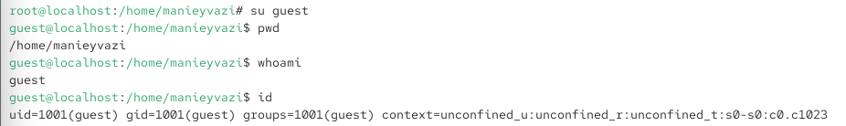
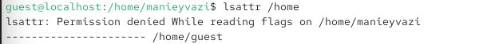
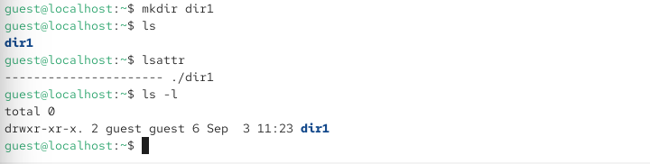

\newpage

{ width=30% }

# перезентации по лабратоной работе №2
Дискреционное
разграничение прав в Linux. Основные
атрибуты

# Цели и задачи работы

## Цель лабораторной работы

Получение практических навыков работы в консоли с атрибутами файлов, закрепление теоретических основ дискреционного разграничения доступа в современных системах с открытым кодом на базе ОС Linux.

\newpage

# Процесс выполнения лабораторной работы

## Создание учётной записи пользователя guest

- От имени администратора (root) создана учётная запись пользователя guest командой `useradd guest`.
- Задан пароль для пользователя guest командой `passwd guest`. При вводе короткого пароля система выдала предупреждение «BAD PASSWORD: The password is shorter than 8 characters», после повторного ввода пароль был успешно обновлён

{ width=60% }

*Рис. 1 — Создание пользователя guest и установка пароля*

\newpage

## Вход в систему от имени пользователя guest

- Выполнен вход от имени пользователя guest командой `su guest`.
- Определена текущая директория командой `pwd` — `/home/manieyvazi`, что не является домашней директорией пользователя guest.
- Выполнен переход в домашнюю директорию пользователя guest.
- Уточнено имя пользователя командой `whoami` — guest.
- Командой `id` получены сведения: uid=1001(guest), gid=1001(guest), groups=1001(guest).

{ width=60% }

*Рис. 2 — Вход под пользователем guest и определение его идентификаторов*

\newpage

## Просмотр учётной записи в файле /etc/passwd

- Просмотрен файл `/etc/passwd` с помощью команды `cat /etc/passwd | grep guest`.
- Найдена учётная запись: `guest:x:1001:1001::/home/guest:/bin/bash`.
- Определены uid=1001 и gid=1001, которые совпадают со значениями, полученными ранее командой `id`.

{ width=85% }

*Рис. 3 — Поиск учётной записи guest в файле /etc/passwd*

\newpage

## Проверка расширенных атрибутов директорий в /home

- Выполнена команда `lsattr /home` для просмотра расширенных атрибутов поддиректорий.
- Для директории `/home/manieyvazi` получен отказ в доступе: «Permission denied While reading flags».
- Расширенные атрибуты директории `/home/guest` — пустые (все атрибуты сняты).
- Увидеть расширенные атрибуты директорий других пользователей не удалось из-за недостатка прав.

{ width=60% }

*Рис. 4 — Просмотр расширенных атрибутов директорий в /home*

\newpage

## Создание поддиректории dir1

- В домашней директории создана поддиректория dir1 командой `mkdir dir1`.
- Командой `lsattr` определено, что расширенные атрибуты на dir1 не установлены.
- Командой `ls -l` определены права доступа: `drwxr-xr-x` (755) — владелец имеет права rwx, группа и остальные — r-x.

{ width=60% }

*Рис. 5 — Создание директории dir1 и проверка её прав и атрибутов*

\newpage

## Снятие атрибутов с директории dir1

- С директории dir1 сняты все атрибуты командой `chmod 000 dir1`.
- Командой `ls -l` проверена правильность выполнения: права изменились на `d---------`.

{ width=60% }

*Рис. 6 — Снятие всех прав с директории dir1*

\newpage

## Попытка создания файла в директории dir1

- Выполнена команда `echo "test" > /home/guest/dir1/file1`.
- Получен отказ: «bash: /home/guest/dir1/file1: Permission denied».
- Причина отказа: на директории dir1 отсутствуют права на запись (w) и выполнение (x), поэтому создание файла невозможно.
- Командой `ls -l /home/guest/dir1` подтверждено, что файл file1 не создан (также получен отказ в доступе).
- Попытка перейти в директорию `cd dir1` также завершилась отказом «Permission denied».
(Отказ в создании файла и переходе в директорию dir1)

{ width=60% }

*Рис. 7*

\newpage

## Таблица «Установленные права и разрешённые действия»

- Опытным путём определено, какие операции разрешены при различных правах на директорию и файл.

| Права директории | Права файла | Создание файла | Удаление файла | Переименование файла | Просмотр файлов | Смена директории | Чтение файла | Запись в файл |
|:---:|:---:|:---:|:---:|:---:|:---:|:---:|:---:|:---:|
| d (000) | (000) | - | - | - | - | - | - | - |
| d --x-- (100) | (000) | - | - | - | - | + | - | - |
| d rwx-- (700) | (000) | + | + | + | + | + | - | - |

(Результаты эксперимента по проверке прав доступа)

\newpage

## Минимально необходимые права для операций внутри директории dir1

- На основании заполненной таблицы определены минимально необходимые права:

| Операция | Минимальные права на директорию | Минимальные права на файл |
|:---|:---:|:---:|
| Создание файла | --x (100) или rwx (700) | (000) |
| Удаление файла | --x (100) или rwx (700) | (000) |
| Переименование файла | --x (100) или rwx (700) | (000) |
| Просмотр файлов в директории | r-x (500) или rwx (700) | (000) |
| Смена директории | --x (100) | (000) |
| Чтение файла | --x (100) | r-- (400) |
| Запись в файл | --x (100) | -w- (200) |

(Определение минимально необходимых прав)

\newpage

# Выводы по проделанной работе

## Вывод

В ходе лабораторной работы были получены практические навыки работы в консоли с атрибутами файлов и закреплены теоретические основы дискреционного разграничения доступа в ОС Linux. Была создана учётная запись пользователя guest, изучены команды `pwd`, `whoami`, `id`, `cat /etc/passwd`, `lsattr`, `ls -l`, `chmod`. Опытным путём установлено, что для выполнения операций внутри директории необходимы права на выполнение (x), а для создания и удаления файлов — также права на запись (w). Продемонстрировано, что при отсутствии прав доступа (chmod 000) владелец директории не может создавать файлы, просматривать содержимое и переходить в неё. Полученные результаты согласуются с целью работы.
