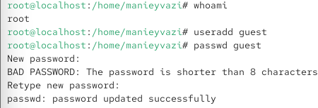
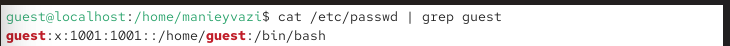
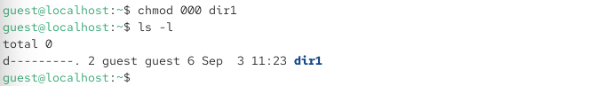
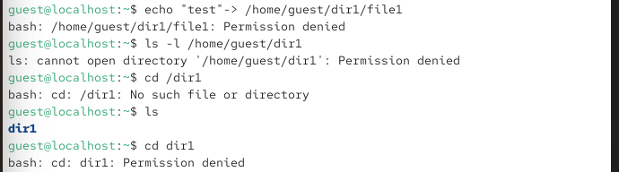
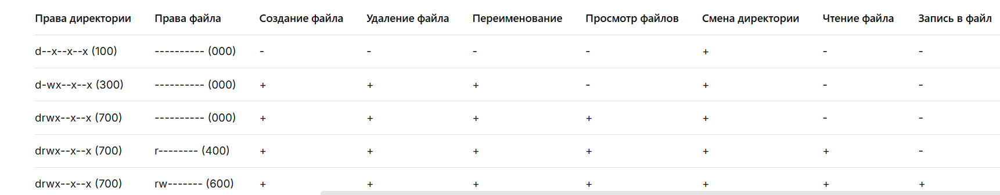

{ width=30%} 

Отчёт по лабораторной работе № 2
Дискреционное разграничение доступа в Linux (атрибуты файлов)

# Цели и задачи работы

## Цель лабораторной работы

Получение практических навыков работы в консоли с атрибутами файлов, закрепление теоретических основ дискреционного разграничения доступа в современных системах с открытым кодом на базе ОС Linux.

## Задачи

1. Создать учётную запись пользователя guest.
2. Задать пароль для guest.
3. Войти в систему от имени guest и изучить информацию о пользователе и группах.
4. Изучить права доступа и расширенные атрибуты файлов и каталогов.
5. Проверить, какие операции разрешены/запрещены при различных комбинациях прав.
6. Заполнить таблицы 2.1 и 2.2.
7. Сделать выводы о минимально необходимых правах.

\newpage

# Процесс выполнения лабораторной работы

## Создание пользователя guest

Действие: Создать учётную запись и задать пароль (от имени администратора).

{ width=85% }

*Рис. 1 — Пользователь guest создан, пароль установлен.*

## Вход в систему от имени guest

Действие: Войти в систему как guest (или переключиться).

{ width=85% }

*Рис. 2 — Вы вошли как guest.*

## Определение текущей директории
Действие: Определить, в какой директории вы находитесь, и сравнить с приглашением командной строки.

{ width=85% }

*Рис. 3 — /home/guest (домашняя директория). Если нет — перейти командой cd ~.*

## Подтверждение имени пользователя
Действие: Уточнить имя текущего пользователя.

{ width=70% }

*Рис. 3 — guest*

## Получение информации о пользователе и группах
Действие: Вывести UID, GID и членство в группах.

{ width=85% }

*Рис. 3 — Сравнить вывод id с groups — списки групп должны совпадать.*

## Сравнение с приглашением командной строки
Действие: Сравнить имя пользователя из id/whoami с приглашением.
Результат: Приглашение вида [guest@hostname ~]$ — имя совпадает.

## Просмотр /etc/passwd
Действие: Просмотреть системную базу пользователей и найти свою учётную запись.
Только своя строка:

{ width=85% }

*Рис. 4 - cat /etc/password*

## Проверка расширенных атрибутов в /home
Действие: Проверить расширенные атрибуты на поддиректориях /home.

{ width=80% }

*Рис. 5 — Видны атрибуты своей директории (например, --------------e-----).
Атрибуты директорий других пользователей не видны из-за ограничений прав (без sudo).

*

## Создание dir1 и проверка атрибутов
Действие: Создать поддиректорию и посмотреть права и атрибуты.

{ width=85% }

*Рис. 6 — создали директорий*

## Снятие всех прав с dir1
Действие: Установить права 000 и проверить.

{ width=85% }

## Попытка создания файла внутри dir1
Действие: Попытаться создать файл в директории без прав.

{ width=80% }

*Рис. 8 —  У директории нет прав w (запись) и x (выполнение) для владельца, поэтому создание файла запрещено. Сообщение об ошибке не создаёт файл.
*

 Директория пуста (файл file1 отсутствует)

{ width=80% }

\newpage

table:

Операции для тестирования:

|Операция|Команда|
|-|-|
|Создание файла|echo "test" > dir1/newfile|
|Удаление файла|rm dir1/file1|
|Переименование файла|mv dir1/file1 dir1/file2|
|Просмотр файлов|ls dir1|
|Смена директории|cd dir1|
|Чтение файла|cat dir1/file1|
|Запись в файл|echo "data" >> dir1/file1|

|Ключевые выводы:|-|
|-|-|
x на директории: 	необходим для входа в директорию и доступа к файлам внутри.
w на директории: 	необходим для создания, удаления и переименования файлов.
r на директории: 	необходим для просмотра списка файлов.
r на файле: 		необходим для чтения содержимого.
w на файле: 		необходим для изменения содержимого.
x на файле: 		необходим для запуска файла как программы.

Заполнение таблицы 2.2 — «Минимально необходимые права»
Действие: На основе таблицы 2.1 определить минимальные права для каждой операции.

Таблица 2.2:

|Операция|Минимальные права директории|Минимальные права файла|
|-|-|-|
|Создание файла|-wx (300)|--- (000)|
|Удаление файла|-wx (300)|--- (000)|
|Переименование файла|-wx (300)|--- (000)|
|Просмотр файлов|r-x (500)|--- (000)|
|Смена директории|--x (100)|--- (000)|
|Чтение файла|--x (100)|r-- (400)|
|Запись в файл|--x (100)|-w- (200)|

\newpage

# Выводы по проделанной работе

## 5. Выводы
- В ходе лабораторной работы я:
- Создал и настроил учётную запись guest.
- Изучил информацию о пользователе и группах с помощью id, groups, whoami и /etc/passwd.
- Изучил права доступа и расширенные атрибуты с помощью ls -l и lsattr.
- Экспериментально определил, какие операции разрешены при различных комбинациях прав.
- Заполнил таблицы 2.1 и 2.2.
- Подтвердил, что дискреционное разграничение доступа в Linux основано на битах r, w, x для владельца, группы и остальных.

# Цель работы достигнута:

получены практические навыки работы с атрибутами файлов и закреплены теоретические основы дискреционного разграничения доступа в Linux.
 