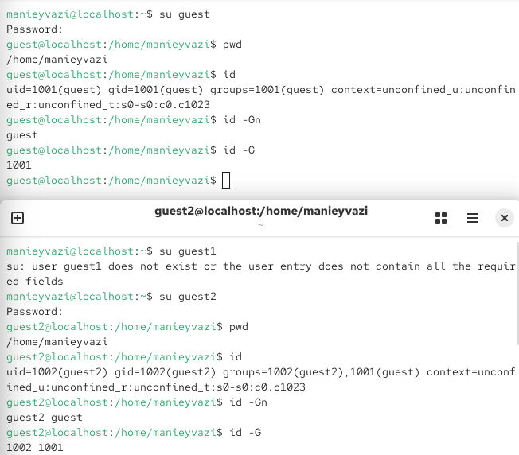
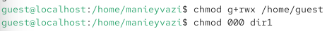
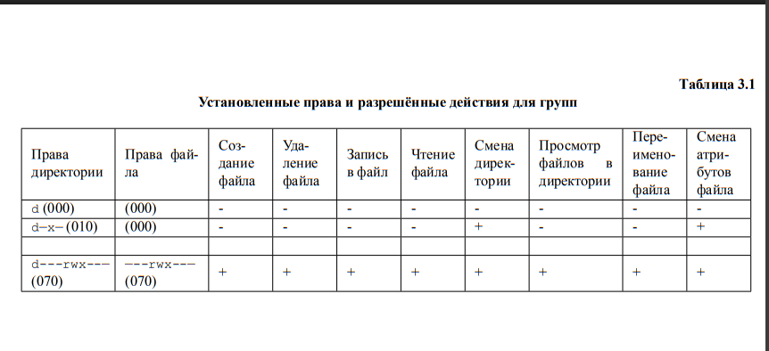
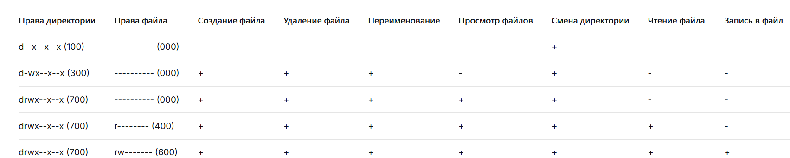

 
\newpage

{ width=30% }

# перезентации по лабраторной работе № 3:
Дискреционное
разграничение прав в Linux. Два пользователя

# Цели и задачи работы

## Цель лабораторной работы
Получение практических навыков работы в консоли с атрибутами файлов для групп пользователей.

\newpage

# Процесс выполнения лабораторной работы

## Создание второго пользователя guest2 и добавление его в группу guest
От имени администратора (root) создана учётная запись второго пользователя командой `useradd guest2`.
- Задан пароль для пользователя guest2 командой `passwd guest2`. При первом вводе возникли ошибки: «BAD PASSWORD: No password supplied» и «Sorry, passwords do not match», после повторного выполнения команды пароль был успешно установлен (с предупреждением о коротком пароле).
- Пользователь guest2 добавлен в группу guest командой `gpasswd -a guest2 guest`.

{ width=85% }

*Рис. 1 — Создание пользователя guest2 и установка пароля*

\newpage

## Проверка членства в группе

- Просмотрен файл `/etc/group` командой `cat /etc/group` для проверки состава групп.
- В выводе видно, что пользователь guest2 добавлен в группу guest: `guest:x:1001:guest2`.

{ width=85% }

*Рис. 2 — Проверка членства guest2 в группе guest в файле /etc/group*

\newpage

## Вход в систему от двух пользователей и определение их групп

- Выполнен вход от имени пользователя guest и guest2 в двух разных консолях.
- Для обоих пользователей командой `pwd` определена текущая директория — `/home/manieyvazi`.
- Командой `id` для guest получены сведения: uid=1001(guest), gid=1001(guest), groups=1001(guest).
- Командой `id` для guest2 получены сведения: uid=1002(guest2), gid=1002(guest2), groups=1002(guest2),1001(guest).
- Команды `id -Gn` и `id -G` подтвердили, что guest2 входит в группы guest2 и guest.

{ width=85% }

*Рис. 3 — Определение групп пользователей guest и guest2*

\newpage

## Регистрация guest2 в группе guest и изменение прав директории /home/guest

- От имени пользователя guest2 выполнена регистрация в группе guest командой `newgrp guest`.
- От имени пользователя guest изменены права директории `/home/guest`, разрешив все действия для пользователей группы: `chmod g+rwx /home/guest`.
- С директории `/home/guest/dir1` сняты все атрибуты командой `chmod 000 dir1`.

{ width=70% }

*Рис. 4 — Изменение прав директории /home/guest и снятие атрибутов с dir1*

\newpage

## аблица «Установленные права и разрешённые действия для групп»

- Опытным путём определено, какие операции разрешены пользователю guest2 при различных правах на директорию и файл.

{ width=85% }

*Рис. 5 — table2 - Установленные права и разрешённые действия для групп*

\newpage

## Сравнение таблиц 2.1 и 3.1

- Таблица 2.1 (лабораторная работа №2) описывала права владельца директории и файлов.
- Таблица 3.1 описывает права пользователя guest2, который входит в группу guest, но не является владельцем файлов.
- Результаты показали, что для выполнения операций внутри директории пользователю из группы необходимы права на выполнение (x) для смены директории, а для создания и удаления файлов — также права на запись (w) для группы.
- Для чтения и записи в файл необходимы соответствующие права на сам файл (r и w соответственно)

{ width=85% }

*Рис. 6*

\newpage

## таблица №1

{ width=80% }

*Рис. 7*

\newpage

## 7.Минимально необходимые права для выполнения операций пользователем guest2 внутри директории dir1
| Операция | Минимальные права на директорию | Минимальные права на файл |
|:---|:---:|:---:|
| Создание файла | -wx--x--x (300) | (000) |
| Удаление файла | -wx--x--x (300) | (000) |
| Переименование файла | -wx--x--x (300) | (000) |
| Просмотр файлов в директории | rwx--x--x (700) | (000) |
| Смена директории | --x--x--x (100) | (000) |
| Чтение файла | --x--x--x (100) | r-------- (400) |
| Запись в файл | --x--x--x (100) | rw------- (600) |

- На основании заполненной таблицы 3.1 определены минимально необходимые права:

{ width=85% }

*Рис. 8 — Минимально необходимые права для операций внутри dir1*

# Выводы по проделанной работе

## Вывод

В ходе лабораторной работы были получены практические навыки работы в консоли с атрибутами файлов для групп пользователей. Была создана учётная запись второго пользователя guest2, который был добавлен в группу guest. С помощью команд `groups`, `id -Gn`, `id -G` и `cat /etc/group` подтверждено членство guest2 в группе guest. Опытным путём установлено, что для выполнения операций внутри директории пользователем из группы необходимы права на выполнение (x) для смены директории, а для создания и удаления файлов — также права на запись (w) для группы. Для чтения и записи в файл необходимы соответствующие права на сам файл. Результаты согласуются с целью работы.
