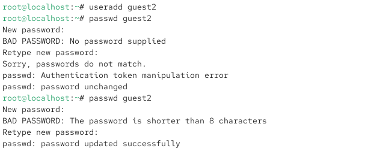
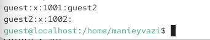

{ width=30%} 

Отчёт по лабораторной работе № 3

# Цели и задачи работы

## Цель лабораторной работы
Получение практических навыков работы в консоли с атрибутами файлов для групп пользователей.

## Задачи

1. Создать учётные записи guest и guest2.
2.  Добавить guest2 в группу guest.
3. Войти в систему от двух пользователей на двух разных консолях.
4.  Определить директории, имена пользователей, группы.
5.  Сравнить информацию с /etc/group.
6.  Зарегистрировать guest2 в группе guest.
7.  Изменить права директории /home/guest, разрешив все действия для группы.
8.  Снять атрибуты с /home/guest/dir1.
9.  Заполнить таблицы 3.1 и 3.2, сравнив с таблицей 2.1 из лабораторной № 2.

\newpage

# Процесс выполнения лабораторной работы

## Создание пользователя guest

Действие: Создать учётную запись guest и задать пароль (от имени администратора).

### Команды:
useradd guest
passwd guest

Результат: Пользователь guest создан, пароль установлен.

## Создание пользователя guest2

Действие: Создать вторую учётную запись guest2 и задать пароль.

{ width=85% }

*Рис. 2 — Пользователь guest2 создан, пароль установлен.*

## Добавление guest2 в группу guest

Действие: Добавить пользователя guest2 в группу guest.

{ width=85% }

*Рис. 3 — Adding user guest2 to group guest*

## Вход в систему от двух пользователей на двух консолях

Действие: Открыть две консоли (или два терминала) и войти:
В первой консоли — как guest.
Во второй консоли — как guest2.

{ width=70% }

*Рис. 4 — Оба пользователя авторизованы в своих сессиях.*

## Определение текущей директории
Действие: Для обоих пользователей определить текущую директорию и сравнить с приглашением.

Команды (в обеих консолях):

{ width=70% }

*Рис. 4 — Приглашения командной строки соответствуют именам пользователей.*

## Определение имён пользователей и групп
Действие: Уточнить имя пользователя, его группу и членство в группах.

Команды (в консоли guest):
Команды (в консоли guest2):

{ width=70% }

*Рис. 4*

## Просмотр /etc/group
Действие: Сравнить полученную информацию с содержимым файла /etc/group.

{ width=85% }

*Рис. 5 - ()*

## Регистрация guest2 в группе guest
Действие: От имени guest2 выполнить регистрацию в группе guest.

Команда (в консоли guest2):

{ width=70% }

*Рис. 4 — Текущая группа изменена на guest. Приглашение может измениться.*
Теперь guest2 активно использует группу guest.

## Изменение прав директории /home/guest

Действие: От имени guest разрешить все действия для пользователей группы.

Команда (в консоли guest):

{ width=85% }

*Рис. 6 — Теперь группа guest имеет права rwx на домашнюю директорию guest.*

## Заполнение таблицы 3.1 — «Установленные права и разрешённые действия для группы»

Действие: Меняя атрибуты у директории dir1 и файла file1 от имени guest, проверять операции от имени guest2. Заполнить таблицу.

{ width=85% }

*Рис. 7 — ()*

\newpage
## 1. Как тестировать:

В консоли guest установить права:

*chmod <права\_директории> dir1*
*chmod <права\_файла> dir1/file1*

2.В консоли guest2 попробовать выполнить операцию и записать + или -.
Операции для тестирования (от имени guest2):

|Операция|Команда|
|-|-|
Создание файла|					echo "test" > /home/guest/dir1/newfile
Удаление файла|					rm /home/guest/dir1/file1
Переименование файла|		       		mv /home/guest/dir1/file1 /home/guest/dir1/file2
Просмотр файлов|				ls /home/guest/dir1
Смена директории|				cd /home/guest/dir1
Чтение файла	|				cat /home/guest/dir1/file1
Запись в файл	|				echo "data" >> /home/guest/dir1/file1

Таблица 3.1 (пример заполнения):

{ width=80% }

Сравнение с таблицей 2.1 (лабораторная № 2):

В таблице 2.1 права проверялись для владельца (первые три бита).

В таблице 3.1 права проверяются для группы (вторые три бита).

## Ключевые выводы:

1. x на директории для группы: необходим для входа в директорию и доступа к файлам.
2. w на директории для группы: необходим для создания, удаления и переименования файлов.
3. r на директории для группы: необходим для просмотра списка файлов.
4. r на файле для группы: необходим для чтения содержимого.
5. w на файле для группы: необходим для изменения содержимого.
6. x на файле для группы: необходим для запуска файла как программы.

Результаты аналогичны: для группы действуют те же правила, что и для владельца, но применяются ко вторым трём битам прав.

|Операция|Минимальные права директории (для группы)|Минимальные права файла (для группы)|
|-|-|-|
Создание файла		|	-wx (030)		|			--- (000)
Удаление файла		|	-wx (030)			|		--- (000)
Переименование файла	|	-wx (030)	|				--- (000)
Просмотр файлов		|	r-x (050)			|		--- (000)
Смена директории	|	--x (010)			|		--- (000)
Чтение файла			|--x (010)				|	r-- (040)
Запись в файл			|--x (010)				|	-w- (020)

В таблице 3.2 указаны права для группы (вторые три бита), так как проверка ведётся от имени guest2, входящего в группу guest.

\newpage

# Выводы по проделанной работе

## Выводы
В ходе лабораторной работы я:
Создал учётные записи guest и guest2.
Добавил guest2 в группу guest с помощью gpasswd.
Вошёл в систему от двух пользователей на двух консолях.
Определил директории, имена пользователей и группы с помощью pwd, whoami, id, groups.
Сравнил информацию с содержимым /etc/group.
Зарегистрировал guest2 в группе guest командой newgrp.
Изменил права директории /home/guest, разрешив все действия для группы.
Снял атрибуты с /home/guest/dir1.
Заполнил таблицы 3.1 и 3.2, сравнив с таблицей 2.1 из лабораторной № 2.
Подтвердил, что для группы действуют те же правила доступа, что и для владельца, но применяются ко вторым трём битам прав.

# Содержание отчёта

□ Титульный лист

□ Цель работы

□ Описание процесса выполнения с командами и снимками экрана

□ Таблица 3.1 — «Установленные права и разрешённые действия для группы»

□ Таблица 3.2 — «Минимально необходимые права для группы»

□ Выводы, согласованные с целью работы

# Цель работы достигнута:
 получены практические навыки работы с атрибутами файлов для групп пользователей.

