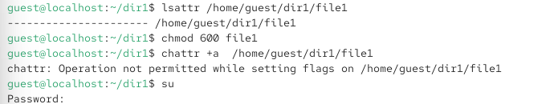
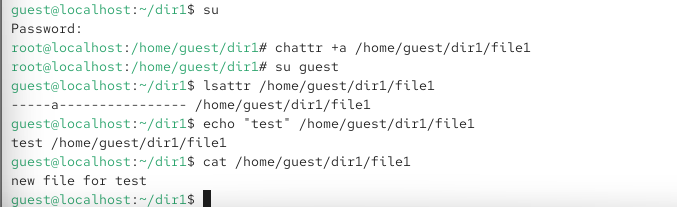
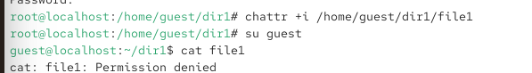

{ width=30%} 

# Отчёт по лабораторной работе № 4
Дискреционное разграничение прав в Linux. Расширенные атрибуты

# Цели и задачи работы

## Цель лабораторной работы
Получение практических навыков работы в консоли с расширенными атрибутами файлов.

## Задачи

1. Определить расширенные атрибуты файла /home/guest/dir1/file1.
2. Установить права 600 на файл file1.
3. Попробовать установить расширенный атрибут a от имени guest (должен быть отказ).
4. Установить расширенный атрибут a от имени суперпользователя.
5. Проверить установку атрибута.
6. Выполнить дозапись в файл, чтение, попытку удаления, перезаписи и переименования.
7. Попробовать изменить права командой chmod 000 file1.
8. Снять атрибут a и повторить операции.
9. Повторить все действия с атрибутом i.
10. Занести наблюдения в отчёт.

\newpage

# Процесс выполнения лабораторной работы

## Определение расширенных атрибутов файла
Действие: От имени пользователя guest определить расширенные атрибуты файла /home/guest/dir1/file1.

{ width=85% }

*Рис. 2 — Атрибут e (extent) — это стандартный атрибут для файловых систем ext4, он не является пользовательским расширенным атрибутом.*

## Установка прав 600 на файл file1
Действие: Установить права, разрешающие чтение и запись для владельца.

{ width=85% }

*Рис. 2*

## Попытка установки атрибута a от имени guest
Действие: Попробовать установить расширенный атрибут a (append only — только дозапись) от имени пользователя guest.

{ width=70% }

*Рис. 3 — Операция отклонена, так как для установки расширенных атрибутов требуются права суперпользователя (root)*

## Установка атрибута a от имени суперпользователя
Действие: Повысить права с помощью su и установить атрибут a от имени root.

{ width=70% }

*Рис. 3 — Атрибут успешно установлен (сообщений об ошибке нет).*

## Проверка установки атрибута a
Действие: От пользователя guest проверить правильность установки атрибута.

{ width=70% }

*Рис. 3 — Атрибут a установлен. Теперь файл можно только дополнять, но нельзя удалять, перезаписывать или переименовывать*

## Дозапись и чтение файла
Действие: Выполнить дозапись в файл file1 слова «test» и прочитать файл.

{ width=70% }
*Рис. 3 - Дозапись (>>) успешно выполнена, слово test записано в файл. Чтение также успешно.*

Примечание: В оригинале лабораторной указана команда echo "test" /home/guest/dir1/file1 (без >>), но для дозаписи необходима именно >>. Если использовать > или без перенаправления, запись не произойдёт.

## Попытка изменения прав командой chmod 000 file1
Действие: Попробовать установить права, запрещающие чтение и запись для владельца.

{ width=80% }

*Рис. 4 — changing permissions of 'file1': Operation not permitted
Пояснение: Атрибут a также запрещает изменение прав доступа к файлу. Команда не выполнена. *

## Снятие атрибута a и повтор операций
Действие: Снять расширенный атрибут a от имени суперпользователя и повторить ранее неудавшиеся операции.

{ width=85% }

*Рис. 5 —*

Затем от имени guest:

bash
*rm /home/guest/dir1/file1*
*echo "abcd" > /home/guest/dir1/file1*
*mv /home/guest/dir1/file1 /home/guest/dir1/file2*
*chmod 000 file1*
Результат: После снятия атрибута a все операции успешно выполнены:
Файл удалён (или перезаписан).
Информация стёрта и заменена на abcd.
Файл переименован.
Права изменены на 000.

Наблюдение: Атрибут a полностью блокирует удаление, перезапись, переименование и изменение прав, но разрешает дозапись и чтение.

## Повтор действий с атрибутом i
Действие: Повторить все шаги, заменив атрибут a на атрибут i (immutable — неизменяемый).

{ width=85% }
*Рис. 6 — ----i--------e----- /home/guest/dir1/file1*

## 

{ width=80% }

*Рис. 8 — ()*

\newpage

## Сравнение атрибутов a и i
|Операция|	Атрибут a (append only)	|Атрибут i (immutable)|
|-|-|-|
Чтение	|			+ |	+
Дозапись (>>)	|		+	 | -
Перезапись (>) |			- |	-
Удаление	|		- |	-
Переименование |			- |	-
Изменение прав (chmod)	 |	-	 | -
Изменение владельца (chown) |	- |	-

# Содержание отчёта
□ Титульный лист
□ Цель работы
□ Описание процесса выполнения с командами и снимками экрана
□ Наблюдения по атрибутам a и i
□ Выводы, согласованные с целью работы

\newpage

# Выводы по проделанной работе

## Выводы
В ходе лабораторной работы я:

1. Определил расширенные атрибуты файла с помощью lsattr.

2. Установил права 600 на файл.

3. Убедился, что для установки расширенных атрибутов требуются права суперпользователя.

4. Установил атрибут a (append only) и проверил его действие:

5. Разрешена дозапись и чтение.

6. Запрещены удаление, перезапись, переименование и изменение прав.

7. Снял атрибут a и повторил операции — все они успешно выполнились.

8. Повторил действия с атрибутом i (immutable):

9. Запрещены все изменения, включая дозапись.

10. Разрешено только чтение.

11. Снял атрибут i и убедился, что операции снова доступны.

## Цель работы достигнута:
получены практические навыки работы с расширенными атрибутами файлов в Linux, изучено действие атрибутов a и i на практике.
