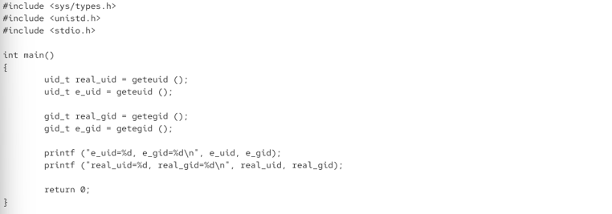
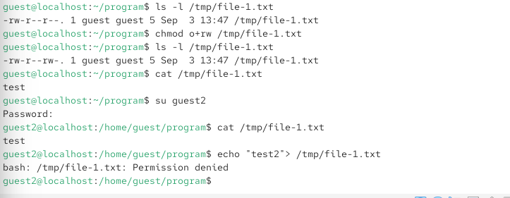
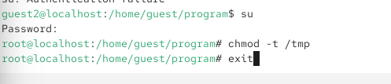
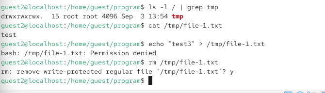

\newpage
{ width=30% }

# Лабораторная работа № 5. 
Дискреционное разграничение доступа

# Цели и задачи работы

## Цель лабораторной работы

Изучение механизмов изменения идентификаторов, применения SetUID- и Sticky-битов. Получение практических навыков работы в консоли с дополнительными атрибутами. Рассмотрение работы механизма смены идентификатора процессов пользователей, а также влияние бита Sticky на запись и удаление файлов.

\newpage

# Процесс выполнения лабораторной работы

## Компиляция программы simpleid.c

Выполнена команда gcc simpleid.c -o simpleid. Компиляция завершилась ошибкой: fatal error: studio.h: No such file or directory. В программе допущена опечатка — вместо stdio.h указан studio.h. Это привело к тому, что компилятор не смог найти заголовочный файл.

{ width=85% }

*Рис. 1*

\newpage

## Проверка идентификаторов пользователя

Выполнена команда id. Она показала: uid=1001(guest), gid=1001(guest), groups=1001(guest), context=unconfined_u:unconfined_r:unconfined_t:s0-s0:c0.c1023. Это означает, что пользователь guest имеет UID 1001 и GID 1001.

{ width=85% }

*Рис. 2*

\newpage

## Исходный код программы simpleid2.c

Приведён код программы simpleid2.c, которая выводит действительные и эффективные идентификаторы пользователя и группы с помощью функций getuid(), geteuid(), getgid(), getegid(). Эта программа будет использоваться для демонстрации работы SetUID- и SetGID-битов.

{ width=85% }

*Рис. 3*

\newpage

##  Установка владельца и SetUID-бита на программу simpleid

Выполнены команды chown root:guest /home/guest/program/simpleid и chmod u+s /home/guest/program/simpleid. Первая команда меняет владельца файла на root и группу на guest. Вторая устанавливает SetUID-бит. После этого команда ls -l /home/guest/program/simpleid показывает права -rwsr-xr-x, где символ s в позиции владельца означает установленный SetUID-бит.

{ width=70% }

*Рис. 4*

\newpage

## Запуск программы simpleid с SetUID-битом

Выполнена команда ./simpleid. Программа вывела: e_uid=0, e_gid=1001, real_uid=0, real_gid=1001. Это означает, что эффективный идентификатор пользователя стал равен 0 (root), хотя реальный идентификатор остался 0. Это демонстрирует работу SetUID-бита: программа выполняется с правами владельца файла (root), а не с правами запустившего её пользователя.

{ width=85% }

*Рис. 5*

\newpage

## Исходный код программы readfile.c

Приведён код программы readfile.c, которая открывает файл, переданный в качестве аргумента, и выводит его содержимое на экран. Программа будет использоваться для демонстрации доступа к файлам с ограниченными правами.

{ width=85% }

*Рис. 6 — ()*

\newpage

## Создание и компиляция программы readfile

Выполнены команды nano readfile.c и gcc readfile.c -o readfile. Программа успешно скомпилирована. Затем создан файл /tmp/file-1.txt с содержимым "test". Команда ls -l /tmp/file-1.txt показывает права -rw-r--r--, владелец guest. После команды chmod o+rw /tmp/file-1.txt права становятся -rw-r--rw-.

{ width=80% }

*Рис. 7 — ()*

\newpage

## Проверка доступа к файлу от имени другого пользователя

Пользователь guest2 пытается прочитать файл /tmp/file-1.txt командой cat. Чтение успешно, выводится "test". Однако при попытке дозаписи командой echo "test2" > /tmp/file-1.txt возникает ошибка Permission denied. Это означает, что, несмотря на права на чтение для всех, права на запись для остальных пользователей отсутствуют.

{ width=85% }

*Рис. 8*

\newpage

## Попытка удаления файла от имени другого пользователя

Пользователь guest2 пытается удалить файл /tmp/file-1.txt командой rm. Система запрашивает подтверждение, затем выводит ошибку: cannot remove '/tmp/file-1.txt': Operation not permitted. Это объясняется наличием Sticky-бита на директории /tmp, который запрещает удалять файлы, не принадлежащие пользователю.

{ width=85% }

*Рис. 9 *

\newpage

## Снятие Sticky-бита с директории /tmp

Выполнена команда su для повышения прав до root, затем chmod -t /tmp для снятия Sticky-бита, и exit для возврата к пользователю guest2. Это подготавливает систему для проверки изменений в поведении файловой системы.

{ width=85% }

*Рис. 10 *

\newpage

## Проверка удаления файла после снятия Sticky-бита

Пользователь guest2 проверяет атрибуты директории /tmp командой ls -l / | grep tmp. Sticky-бит отсутствует. Затем guest2 снова пытается удалить файл /tmp/file-1.txt командой rm. Теперь удаление проходит успешно. Это подтверждает, что Sticky-бит защищает файлы от удаления другими пользователями.

{ width=85% }

*Рис. 11 — ()*

\newpage

## Возврат Sticky-бита на директорию /tmp

Выполнена команда su для повышения прав до root, затем chmod +t /tmp для возврата Sticky-бита, и exit для возврата к пользователю guest2. Это восстанавливает стандартные настройки безопасности директории /tmp.

{ width=85% }

*Рис. 12 — ()*

\newpage

## Поиск компиляторов gcc и g++

Выполнены команды whereis gcc и whereis g++. Первая команда показала пути к компилятору gcc: /usr/bin/gcc, /usr/lib/gcc, /usr/libexec/gcc, /usr/share/man/man1/gcc.1.gz, /usr/share/info/gcc.info.gz. Вторая команда показала пути к g++: /usr/bin/g++, /usr/share/man/man1/g++.1.gz. Это подтверждает наличие компиляторов в системе.

{ width=85% }

*Рис. 13 — ()*

\newpage

## Исходный код программы с ошибкой

Приведён код программы, которая должна выводить uid и gid с помощью geteuid() и getegid(). Однако в коде присутствует ошибка: вместо stdio.h указан studio.h. Это объясняет ошибку компиляции, возникшую на первой фотографии. Для исправления необходимо заменить studio.h на stdio.h.

{ width=85% }

\newpage

# Выводы по проделанной работе

## Вывод

В ходе лабораторной работы были изучены механизмы изменения идентификаторов пользователей и групп, а также применение SetUID- и Sticky-битов. Было установлено, что SetUID-бит позволяет программе выполняться с правами владельца файла, что подтверждено на примере программы simpleid, которая при запуске от имени обычного пользователя получила эффективный UID root. Sticky-бит на директории /tmp запрещает удаление файлов, не принадлежащих пользователю, что было продемонстрировано при попытке удаления файла от имени другого пользователя. После снятия Sticky-бита удаление стало возможным. Также были получены навыки компиляции программ на языке C с помощью gcc и работы с атрибутами файлов в консоли. Ошибка в исходном коде (studio.h вместо stdio.h) наглядно показала важность внимательности при написании программ.