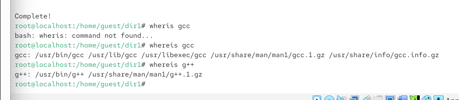
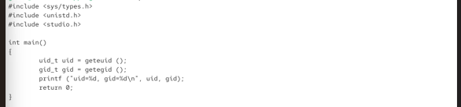
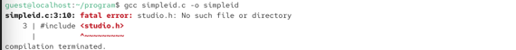
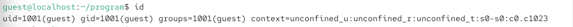
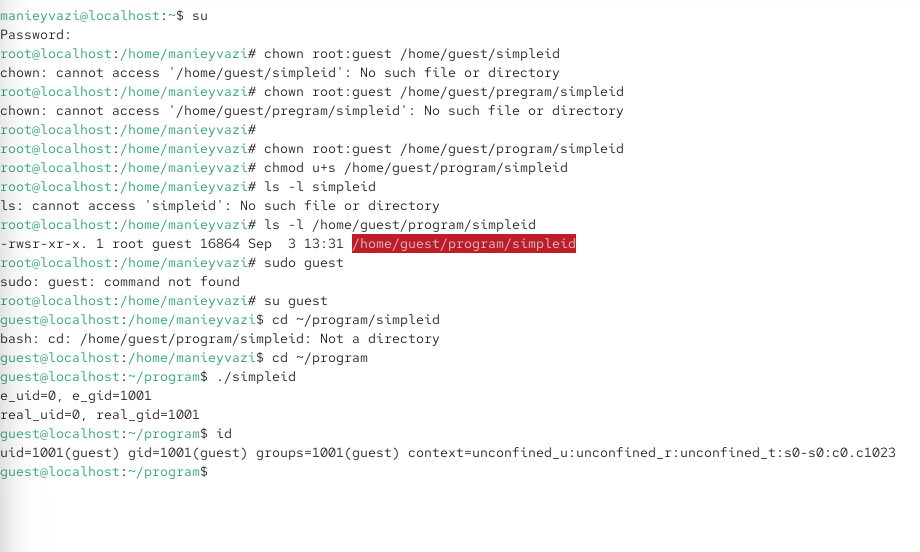
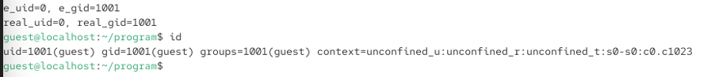
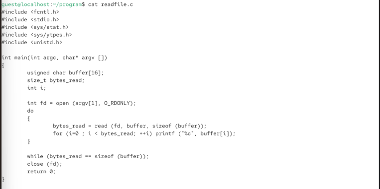
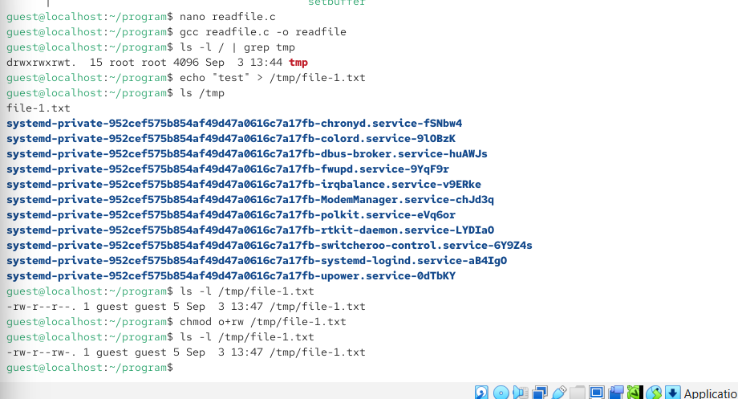
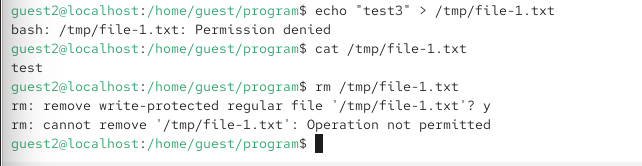
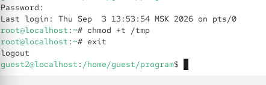

{ width=30%} 

# Отчёт по лабораторной работе № 5
Дискреционное разграничение прав в Linux. SetUID-, SetGID- и Sticky-биты

# Цели и задачи работы

## Цель лабораторной работы

## Задачи

1. Подготовить лабораторный стенд: установить gcc, отключить SELinux.
2. Создать программу simpleid.c, скомпилировать и выполнить её.
3. Сравнить вывод программы с системной командой id.
4. Усложнить программу до simpleid2.c с выводом действительных и эффективных идентификаторов.
5. Установить SetUID- и SetGID-биты, проверить их действие.
6. Создать программу readfile.c, проверить её работу с SetUID-битом.
7. Исследовать Sticky-бит на директории /tmp.
8. Занести наблюдения в отчёт.

\newpage

# Процесс выполнения лабораторной работы

## Подготовка лабораторного стенда

Действие: Проверить наличие компилятора gcc и отключить SELinux.

{ width=85% }

*Рис. 2 — gcc -v выводит версию компилятора (если установлен).*

## Войти как guest, создать программу для вывода эффективных идентификаторов.

Содержимое simpleid.c:

{ width=85% }
{ width=85% }

*Рис. 3,4 — uid=1001, gid=1001*

## Сравнение с системной командой id
Выполнить системную команду id и сравнить результаты.

{ width=85% }

*Рис. 5 — Сравнение: Вывод simpleid совпадает с эффективными идентификаторами из id.*

## Усложнение программы до simpleid2.c
 Добавить вывод действительных и эффективных идентификаторов.
Содержимое simpleid2.c:

{ width=75% }

*Рис. 6 — ()*

## 

{ width=85% }

*Рис. 3 — При обычном запуске действительные и эффективные идентификаторы совпадают.*

Компиляция и запуск:

*gcc simpleid2.c -o simpleid2*
*./simpleid2*

Результат:

*e\_uid=1001, e\_gid=1001*
*real\_uid=1001, real\_gid=1001*

## Установка SetUID-бита

Действие: От имени суперпользователя сменить владельца файла simpleid2 на root и установить SetUID-бит.

{ width=65% }

*Рис. 7 - Бит s в правах владельца означает SetUID.*

## Проверка действия SetUID-бита
Запустить simpleid2 и id от имени guest.

{ width=80% }

*Рис. 8 — При запуске simpleid2 эффективный UID стал 0 (root), так как установлен SetUID-бит и владелец файла — root. Это позволяет программе выполняться с правами суперпользователя.*

## Создание программы readfile.c
Действие: Создать программу для чтения файла.
Содержимое readfile.c:
{ width=70% }

*Рис. 9*

## Подготовка файла для чтения
Действие: Сменить владельца файла readfile.c на root и установить права, запрещающие чтение для guest.

{ width=85% }

*Рис. 10*

## Установка SetUID-бита на readfile

Действие: Сменить владельца программы readfile на root и установить SetUID-бит.

{ width=65% }
*Рис. 7*

## Проверка чтения файла readfile.c
Попробовать прочитать readfile.c с помощью readfile.

{ width=65% }
*Рис. 10 — Программа readfile имеет SetUID-бит и владельца root, поэтому выполняется с правами root и может читать файл, недоступный для guest.*

## Проверка Sticky-бита на /tmp
Выяснить, установлен ли Sticky-бит на /tmp.

{ width=80% }
*Рис. 10 - Бит t в правах означает Sticky-бит.*

## Создание файла в /tmp
 От имени guest создать файл file01.txt со словом test.

{ width=80% }
*Рис. 10*

## Чтение файла от guest2
От имени guest2 прочитать файл.

{ width=75% }
*Рис. 11 - Чтение разрешено, так как права o+r установлены.*

## Дозапись в файл от guest2
Попробовать дозаписать слово test2.

{ width=75% }
*Рис. 11 - Дозапись разрешена, так как права o+w установлены *

## Перезапись файла от guest2
Действие: Попробовать перезаписать файл словом test3.

{ width=80% }
*Рис. 12 - Sticky-бит на /tmp запрещает удаление файлов, владельцем которых не является текущий пользователь. guest2 не владелец файла, поэтому удаление запрещено.*

## Снятие Sticky-бита
Действие: От имени суперпользователя снять Sticky-бит с /tmp.
{ width=75% }
*Рис. 13 - Бит t отсутствует.*

## Повторная попытка удаления
Действие: От имени guest2 попробовать удалить файл.

{ width=75% }
*Рис. 14 - Без Sticky-бита любой пользователь с правами на запись в директорию может удалять файлы, даже если он не является их владельцем.*

## Возврат Sticky-бита
Действие: Вернуть Sticky-бит на /tmp.

{ width=80% }
*Рис. 15 - Sticky-бит восстановлен.*

\newpage

# Содержание отчёта

□ Титульный лист

□ Цель работы

□ Описание процесса выполнения с командами и снимками экрана

□ Листинги программ (simpleid.c, simpleid2.c, readfile.c)

□ Наблюдения по SetUID-, SetGID- и Sticky-битам

□ Выводы, согласованные с целью работы

# Выводы по проделанной работе

##  Выводы
В ходе лабораторной работы я:

1. Подготовил лабораторный стенд: установил gcc, отключил SELinux.
2. Создал и скомпилировал программы simpleid.c, simpleid2.c, readfile.c.
3. Изучил разницу между действительными и эффективными идентификаторами.
4. Установил SetUID- и SetGID-биты и убедился, что:
5. SetUID позволяет программе выполняться с правами владельца файла (root).
6. SetGID позволяет программе выполняться с правами группы владельца файла.
7. Продемонстрировал, что SetUID-программа может читать файлы, недоступные обычному пользователю (включая /etc/shadow).
8. Исследовал Sticky-бит на /tmp:
9. При установленном Sticky-бите удалять файлы может только их владелец (или root).
10. Без Sticky-бита любой пользователь с правами на запись в директорию может удалять чужие файлы.
11. Убедился в потенциальной опасности SetUID-программ и важности Sticky-бита для общих директорий.

# Цель работы достигнута:
получены практические навыки работы с SetUID-, SetGID- и Sticky-битами, изучены механизмы смены идентификаторов процессов.

\newpage

# Листинги программ

simpleid.c

c

\#include <sys/types.h>

\#include <unistd.h>

\#include <stdio.h>

int main() {

    uid\_t uid = geteuid();

    gid\_t gid = getegid();

    printf("uid=%d, gid=%d\\n", uid, gid);

    return 0;

}

simpleid2.c

c

\#include <sys/types.h>

\#include <unistd.h>

\#include <stdio.h>

int main() {

    uid\_t real\_uid = getuid();

    uid\_t e\_uid = geteuid();

    gid\_t real\_gid = getgid();

    gid\_t e\_gid = getegid();

    printf("e\_uid=%d, e\_gid=%d\\n", e\_uid, e\_gid);

    printf("real\_uid=%d, real\_gid=%d\\n", real\_uid, real\_gid);

    return 0;

}

readfile.c

c

\#include <fcntl.h>

\#include <stdio.h>

\#include <sys/stat.h>

\#include <sys/types.h>

\#include <unistd.h>

int main(int argc, char\* argv\[]) {

   unsigned char buffer\[16];

   size\_t bytes\_read;

   int i;

    int fd = open(argv\[1], O\_RDONLY);

    do {

        bytes\_read = read(fd, buffer, sizeof(buffer));

        for (i = 0; i < bytes\_read; ++i)

            printf("%c", buffer\[i]);

    } while (bytes\_read == sizeof(buffer));

    close(fd);

    return 0;

}

