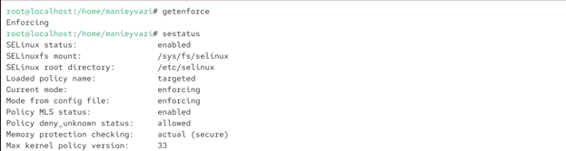
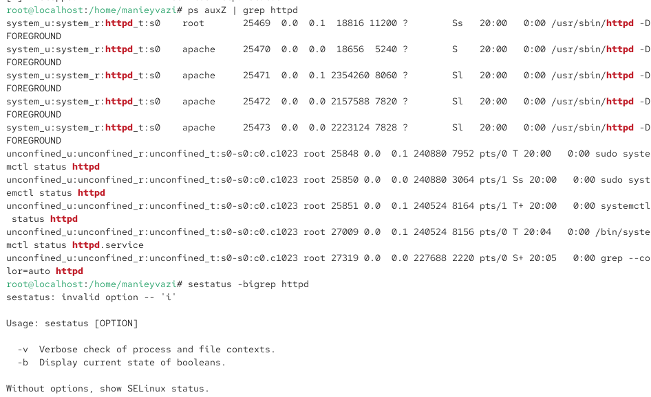
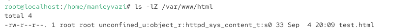
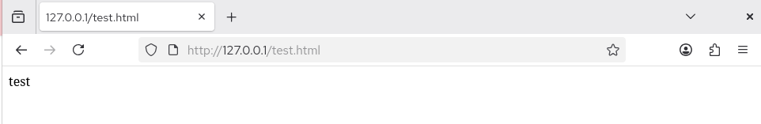
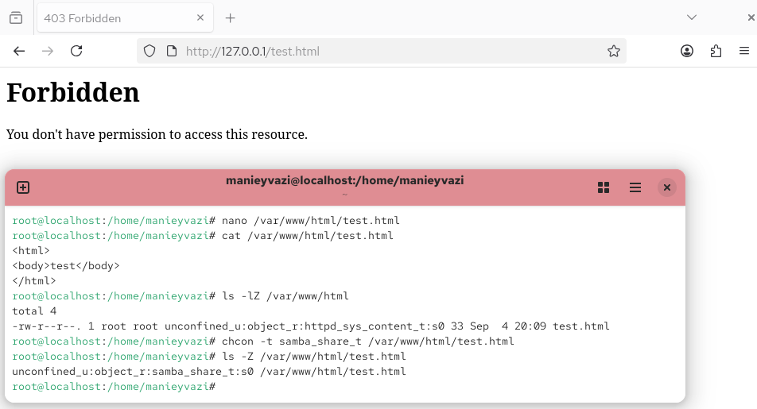
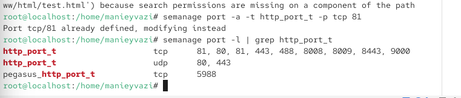
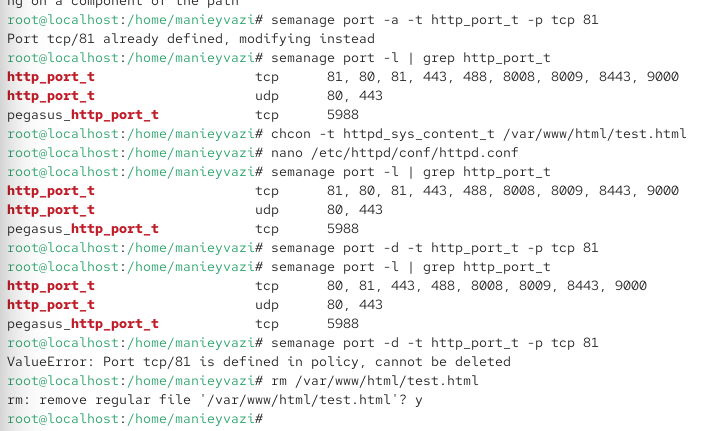

\newpage

{ width=30% }

# Лабораторная работа № 6.
Технология SELinux

# Цели и задачи работы

## Цель лабораторной работы

Развить навыки администрирования ОС Linux. Получить первое практическое знакомство с технологией SELinux. Проверить работу SELinux на практике совместно с веб-сервером Apache.

\newpage

# Процесс выполнения лабораторной работы

## Выполнены команды getenforce и sestatus. 
Команда getenforce показала, что SELinux работает в режиме Enforcing. Команда sestatus подтвердила, что SELinux включён (status: enabled), используется политика targeted, текущий режим — enforcing. Это соответствует требованиям лабораторной работы.

{ width=85% }

*Рис. 1 — Проверка режима работы SELinux*

\newpage

## Выполнена команда service httpd status.
 Веб-сервер Apache активен (active (running)), загружен и работает. В выводе также отображаются основные процессы httpd и их идентификаторы. Это означает, что веб-сервер готов к работе.

{ width=85% }

*Рис. 2 — Проверка статуса веб-сервера Apache*

\newpage

## Выполнена команда ps auxZ | grep httpd.
 В выводе видно, что процессы httpd запущены в контексте безопасности system_u:system_r:httpd_t:s0. Это означает, что процессы веб-сервера работают в домене httpd_t, который имеет ограниченные права в соответствии с политикой SELinux. Также в выводе присутствуют процессы, запущенные в контексте unconfined_u:unconfined_r:unconfined_t:s0, что связано с работой служебных утилит.

{ width=85% }

*Рис. 3 — Определение контекста безопасности процессов Apache*

\newpage

## Выполнена команда seinfo.
 Она показала статистику по политике: количество классов, разрешений, типов, пользователей, ролей, логических выражений и т.д. Например, типов — 4699, пользователей — 8, ролей — 15. 

{ width=70% }

*Рис. 4 — Это демонстрирует масштаб политики SELinux.*

\newpage

## Выполнена команда ls -lZ /var/www.
В выводе отображаются файлы и поддиректории с их SELinux-контекстами. Это позволяет понять, какие типы присвоены объектам в данной директории.(Определение типов файлов в директории /var/www)

{ width=85% }

*Рис. 5 — Получение статистики по политике SELinux*

\newpage

## Выполнена команда ls -lZ /var/www/html. 
Директория пуста, поэтому выведено только total 0. Это означает, что на момент проверки в ней не было файлов.

{ width=85% }

*Рис. 6 — Определение типов файлов в директории /var/www/html*

\newpage

## Создан файл /var/www/html/test.html с помощью редактора nano. Содержимое файла:

{ width=80% }

*Рис. 7 — Создание тестового HTML-файла*

\newpage

## Выполнена команда ls -lZ /var/www/html.
 Файл test.html получил контекст unconfined_u:object_r:httpd_sys_content_t:s0. Тип httpd_sys_content_t позволяет процессу httpd получить доступ к файлу. Это объясняет, почему файл должен отображаться через веб-сервер.

{ width=85% }

*Рис. 8 — <html> <body>test</body> </html> Затем командой cat проверено его содержимое.Проверка контекста созданного файла*

\newpage

## В браузере введён адрес http://127.0.0.1/test.html.
 Файл успешно отображён, на странице виден текст «test». Это подтверждает, что SELinux не блокирует доступ, так как контекст файла соответствует типу httpd_sys_content_t.

{ width=85% }

*Рис. 9 — Проверка доступа к файлу через веб-сервер*

\newpage

## Выполнена команда chcon -t samba_share_t /var/www/html/test.html.
 Затем командой ls -Z проверен новый контекст: unconfined_u:object_r:samba_share_t:s0. Тип samba_share_t не предназначен для httpd, поэтому доступ должен быть запрещён.

{ width=85% }

*Рис. 10 — Изменение контекста файла на samba_share_t*

\newpage

## В браузере снова запрошен http://127.0.0.1/test.html.
 Получена ошибка 403 Forbidden — «You don't have permission to access this resource». Это произошло потому, что SELinux запретил процессу httpd доступ к файлу с типом samba_share_t, хотя обычные права доступа (rw-r--r--) позволяли чтение.

{ width=85% }

*Рис. 11 — Проверка доступа к файлу после смены контекста*

\newpage

## Выполнены команды ls -l /var/www/html/test.html и tail /var/log/messages.
 В системном логе видно, что SELinux зафиксировал отказ в доступе. Это подтверждает, что политика SELinux активно работает и блокирует нежелательные обращения.

{ width=85% }

*Рис. 12 — Анализ логов*

\newpage

## В файле /etc/httpd/conf/httpd.conf параметр Listen 80 заменён на Listen 81.
 Команда grep Listen показывает, что теперь Apache настроен на порт 81.

{ width=85% }

*Рис. 13 — Изменение порта прослушивания Apache на 81*

\newpage

## Выполнена команда semanage port -a -t http_port_t -p tcp 81.
 Затем командой semanage port -l | grep http_port_t проверено, что порт 81 добавлен в список разрешённых для http_port_t. Это необходимо, чтобы SELinux позволил Apache использовать порт 81.

{ width=85% }

*Рис. 14 — Добавление порта 81 в политику SELinux*

\newpage

## После возврата контекста httpd_sys_content_t файлу test.html и запуска Apache на порту 81, в браузере запрошен http://127.0.0.1:81/test.html.
 Файл успешно отображён. Это доказывает, что SELinux контролирует не только типы файлов, но и сетевые порты.

{ width=85% }

*Рис. 15 — Проверка доступа к файлу через порт 81*

\newpage

## Выполнены команды semanage port -d -t http_port_t -p tcp 81 и rm /var/www/html/test.html.
 При попытке удаления порта 81 получена ошибка ValueError: Port tcp/81 is defined in policy, cannot be deleted. Это означает, что порт 81 уже был определён в политике по умолчанию, поэтому его нельзя удалить. Файл test.html успешно удалён.

{ width=85% }

*Рис. 16 — Удаление привязки порта 81 и файла test.html*

\newpage

# Выводы по проделанной работе

## Вывод

В ходе лабораторной работы были изучены основы администрирования SELinux в Linux. Было подтверждено, что SELinux работает в режиме enforcing с политикой targeted. На практике проверено, что SELinux контролирует доступ процессов к файлам на основе контекстов безопасности, а также управляет сетевыми портами. Изменение контекста файла на несоответствующий тип приводит к блокировке доступа, даже если стандартные права доступа разрешают чтение. Добавление порта в политику SELinux позволяет веб-серверу использовать нестандартный порт. Таким образом, SELinux является мощным механизмом мандатного разграничения доступа, который дополняет дискреционные права и повышает безопасность системы.