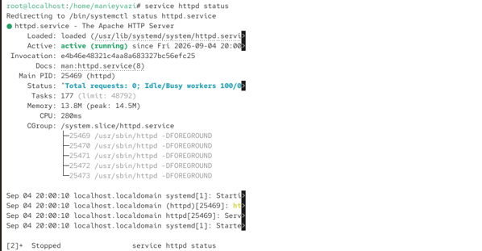
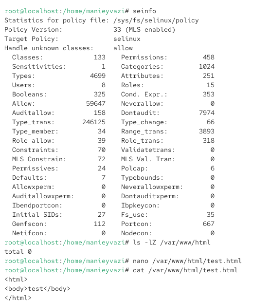
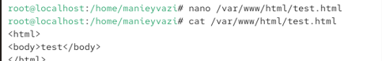
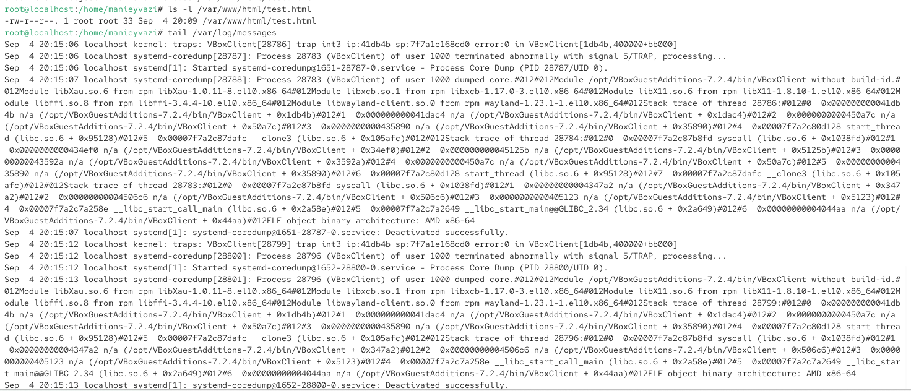
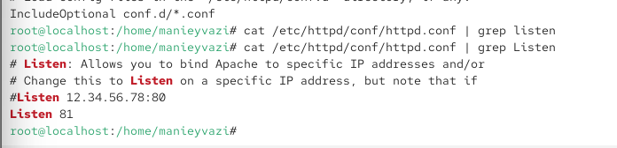
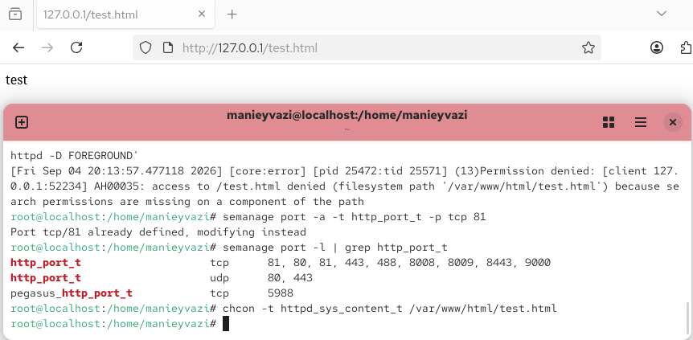

\newpage

{ width=30%} 

# Отчёт по лабораторной работе № 6
SELinux: администрирование и взаимодействие с веб-сервером Apache

# Цели и задачи работы

## Цель лабораторной работы
Развить навыки администрирования ОС Linux. Получить первое практическое знакомство с технологией SELinux. Проверить работу SELinux на практике совместно с веб-сервером Apache.

## Задачи

1. Проверить, что SELinux работает в режиме enforcing с политикой targeted.
2. Убедиться, что веб-сервер Apache запущен.
3. Определить контекст безопасности веб-сервера Apache.
4. Посмотреть текущее состояние переключателей SELinux для Apache.
5. Посмотреть статистику по политике с помощью seinfo.
6. Определить типы файлов и поддиректорий в /var/www.
7. Создать HTML-файл в /var/www/html и проверить его контекст.
8. Обратиться к файлу через веб-сервер.
9. Изменить контекст файла и проверить, что доступ пропадает.
10. Попробовать запустить Apache на порту 81 и проанализировать ошибки.
11. Настроить SELinux для разрешения работы на порту 81.
12. Вернуть конфигурацию в исходное состояние.
13. Удалить созданный файл.

\newpage

# Процесс выполнения лабораторной работы

## Проверка режима SELinux

Действие: Войти в систему и убедиться, что SELinux работает в режиме enforcing с политикой targeted.

{ width=85% }

*Рис. 2*

## Проверка работы веб-сервера Apache
Убедиться, что Apache запущен. Если нет — запустить.

{ width=70% }

*Рис. 3*

## Определение контекста безопасности Apache
Действие: Найти веб-сервер Apache в списке процессов и определить его контекст безопасности.

{ width=65% }

*Рис. 4*

## Просмотр текущего состояния переключателей SELinux для Apache
Посмотреть состояние переключателей SELinux для Apache.

{ width=65% }

*Рис. 4 — Большинство переключателей находятся в положении off.*

## Просмотр статистики по политике
Посмотреть статистику по политике с помощью seinfo.

{ width=60% }

*Рис. 5 — seinfo выводит общую статистику: количество пользователей, ролей, типов, классов, правил.*

*seinfo -u — список пользователей SELinux.*
*seinfo -r — список ролей.*
*seinfo -t — список типов.*

## Определение типов файлов в /var/www/html
Определить тип файлов в /var/www/html.

{ width=60% }

*Рис. 5*

## Создание HTML-файла
Действие: От имени суперпользователя создать HTML-файл /var/www/html/test.html.

{ width=80% }

*Рис. 5 — файл создан!*

## Проверка контекста созданного файла
Проверить контекст, присваиваемый по умолчанию вновь созданным файлам.

{ width=85% }

*Рис. 7 — Контекст по умолчанию:*

## Обращение к файлу через веб-сервер
Открыть в браузере адрес http://127.0.0.1/test.html.

{ width=85% }

*Рис. 8 — Тип httpd\_sys\_content\_t позволяет процессу httpd получить доступ к файлу.*

## Изменение контекста файла
Изменить контекст файла test.html на samba\_share\_t.
Команда:

{ width=65% }

*Рис. 9*

## Попытка доступа к файлу через веб-сервер
Открыть в браузере http://127.0.0.1/test.html.

{ width=70% }

*Рис. 9 — Тип samba\_share\_t не разрешает процессу httpd доступ к файлу. SELinux блокирует доступ, несмотря на то, что права доступа позволяют читать файл любому пользователю.*

## Анализ ситуации
Действие: Проанализировать, почему файл не был отображён, и просмотреть логи.

{ width=70% }

*Рис. 10 — Проблема не в стандартных правах доступа, а в политике SELinux. Процесс httpd не имеет разрешения на чтение файлов с типом samba\_share\_t.*

## Попытка запуска Apache на порту 81
Действие: Изменить конфигурационный файл Apache для прослушивания порта 81.

{ width=80% }

*Рис. 11 — SELinux запрещает Apache прослушивать порт 81, так как этот порт не привязан к типу http\_port\_t.*

## Анализ лог-файлов
Действие: Просмотреть лог-файлы.

{ width=65% }

*Рис. 12 — В /var/log/messages и /var/log/audit/audit.log появляются записи об отказе SELinux в привязке к порту 81.*
В /var/log/httpd/error\_log — сообщение о невозможности привязки к порту.

## Настройка SELinux для порта 81
Разрешить Apache прослушивать порт 81.
Команда:

{ width=80% }

*Рис. 13 — Порт 81 добавлен в список портов, разрешённых для типа http\_port\_t.*

## Повторный запуск Apache
Перезапустить Apache.

{ width=75% }

*Рис. 14 — Теперь SELinux разрешает Apache прослушивать порт 81.*

## Возврат контекста файла
Действие: Вернуть контекст httpd\_sys\_content\_t файлу test.html.

{ width=75% }
*Рис. 14*

## Удаление привязки порта 81
Действие: Удалить привязку http\_port\_t к порту 81.

{ width=65% }
*Рис. 15 — Порт 81 удалён из списка.*

## Удаление созданного файла
Действие: Удалить файл /var/www/html/test.html.

{ width=65% }
*Рис. 15 — Файл удалён.*

\newpage

# Содержание отчёта

□ Титульный лист

□ Цель работы

□ Описание процесса выполнения с командами и снимками экрана

□ Выводы, согласованные с целью работы

# Выводы по проделанной работе

## Выводы

В ходе лабораторной работы я:

1. Убедился, что SELinux работает в режиме enforcing с политикой targeted.
2. Определил контекст безопасности веб-сервера Apache: system\_u:system\_r:httpd\_t:s0.
3. Изучил переключатели SELinux для Apache (большинство в положении off).
4. Посмотрел статистику по политике с помощью seinfo.
5. Определил типы файлов в /var/www и /var/www/html.
6. Создал HTML-файл и убедился, что ему присваивается тип httpd\_sys\_content\_t, который разрешает доступ через веб-сервер.
7. Изменил контекст файла на samba\_share\_t и убедился, что доступ через веб-сервер пропал, несмотря на стандартные права доступа.
8. Проанализировал логи и убедился, что SELinux блокирует доступ.
9. Попробовал запустить Apache на порту 81 и получил отказ из-за политики SELinux.
10. Настроил SELinux для разрешения работы на порту 81 с помощью semanage.
11. Убедился, что после настройки Apache успешно запустился.
12. Вернул конфигурацию в исходное состояние и удалил созданный файл.
13. Ключевой вывод: SELinux обеспечивает дополнительный уровень безопасности, контролируя доступ процессов к файлам и сетевым портам на основе контекстов безопасности, независимо от стандартных прав доступа. Это позволяет ограничить потенциальный ущерб от компрометации сервисов.

# Цель работы достигнута:
получены практические навыки администрирования SELinux и взаимодействия с веб-сервером Apache.

\newpage

# Краткая сводка команд

bash

\# Проверка SELinux

getenforce

sestatus

\# Проверка Apache

service httpd status

service httpd start

\# Контекст Apache

ps auxZ | grep httpd

ps -eZ | grep httpd

\# Переключатели SELinux

sestatus -bigrep httpd

\# Статистика политики

seinfo

seinfo -u

seinfo -r

seinfo -t

\# Типы файлов

ls -lZ /var/www

ls -lZ /var/www/html

\# Создание файла

su -

cat > /var/www/html/test.html << 'EOF'

<html>

<body>test</body>

</html>

EOF

\# Проверка контекста

ls -Z /var/www/html/test.html

\# Изменение контекста

chcon -t samba\_share\_t /var/www/html/test.html

ls -Z /var/www/html/test.html

\# Анализ логов

tail /var/log/messages

tail -n 50 /var/log/httpd/error\_log

tail -n 50 /var/log/audit/audit.log

\# Изменение порта

vi /etc/httpd/conf/httpd.conf

\# Listen 80 -> Listen 81

service httpd restart

\# Настройка SELinux для порта

semanage port -a -t http\_port\_t -p tcp 81

semanage port -l | grep http\_port\_t

\# Возврат контекста

chcon -t httpd\_sys\_content\_t /var/www/html/test.html

\# Возврат конфигурации

vi /etc/httpd/conf/httpd.conf

\# Listen 81 -> Listen 80

service httpd restart

\# Удаление привязки порта

semanage port -d -t http\_port\_t -p tcp 81

semanage port -l | grep http\_port\_t

\# Удаление файла

rm /var/www/html/test.html
