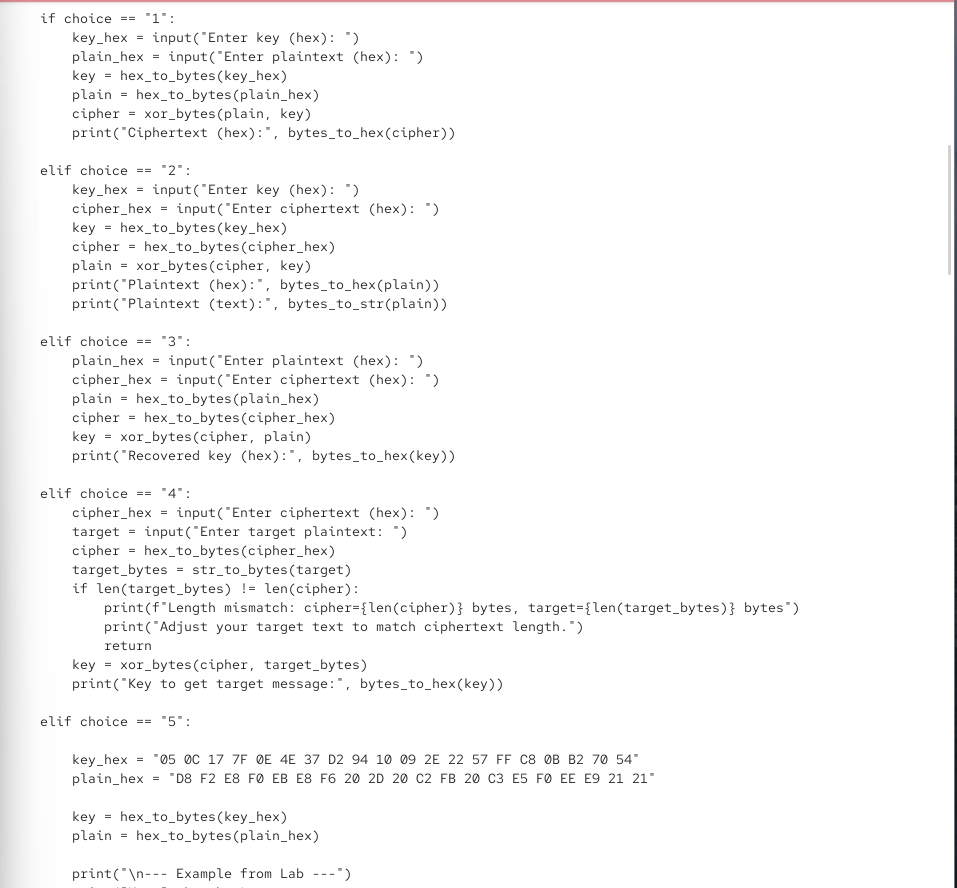
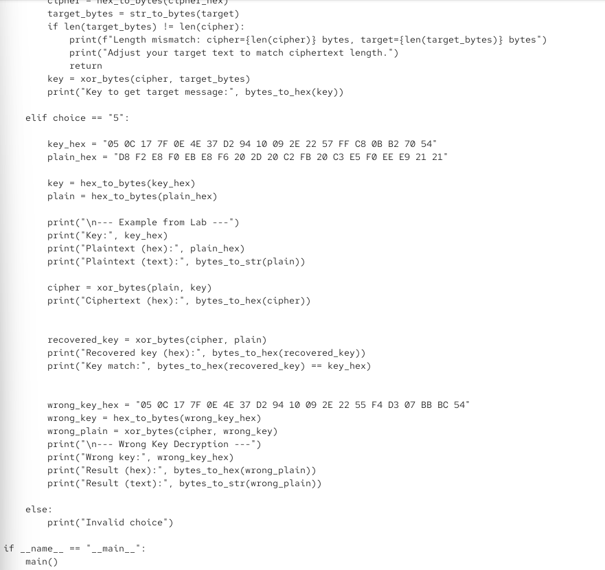
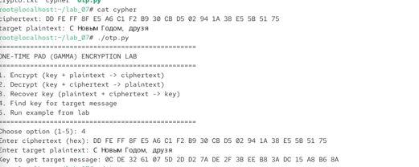

\newpage

{ width=30% }

# перезентации по лабраторной работе №7:
 Элементы криптографии. Однократное гаммирование

# Цели и задачи работы

## Цель лабораторной работы

Освоить на практике применение режима однократного гаммирования.

\newpage

# Процесс выполнения лабораторной работы

## Разработка приложения для шифрования и дешифрования в режиме однократного гаммирования

- Разработано приложение `otp.py` на языке Python, реализующее режим однократного гаммирования (One-Time Pad).
- Приложение поддерживает пять режимов работы:
  1. Шифрование (ключ + открытый текст → шифротекст).
  2. Дешифрование (ключ + шифротекст → открытый текст).
  3. Восстановление ключа (открытый текст + шифротекст → ключ).
  4. Подбор ключа для целевого сообщения.
  5. Запуск примера из лабораторной работы.

{ width=50% length=50% }

*Рис. 1 — Исходный код приложения otp.py (часть 1)*

\newpage

## Реализация функций шифрования и дешифрования

- В приложении реализованы функции:
  - `xor_bytes(data, key)` — выполняет операцию XOR над двумя байтовыми последовательностями одинаковой длины.
  - `hex_to_bytes(hex_str)` — преобразует шестнадцатеричную строку в байты.
  - `bytes_to_hex(b)` — преобразует байты в шестнадцатеричную строку.
  - `str_to_bytes(s)` — преобразует строку в байты с использованием кодировки CP1251 (для кириллицы).
  - `bytes_to_str(b)` — преобразует байты в строку с использованием кодировки CP1251.

{ width=70% }

*Рис. 2 — Исходный код приложения otp.py (часть 2)*

\newpage

## Реализация режимов работы приложения

- В функции `main()` реализованы все пять режимов работы приложения.
- Режим 1: шифрование — выполняет XOR открытого текста с ключом.
- Режим 2: дешифрование — выполняет XOR шифротекста с ключом.
- Режим 3: восстановление ключа — выполняет XOR шифротекста с открытым текстом.
- Режим 4: подбор ключа для целевого сообщения — выполняет XOR шифротекста с целевым открытым текстом.
- Режим 5: запуск примера из лабораторной работы.

{ width=70% }

*Рис. 3 — Исходный код приложения otp.py (часть 3)*

\newpage

## Запуск примера из лабораторной работы

- Выполнена команда `chmod +x otp.py` для предоставления файлу прав на исполнение.
- Выполнена команда `./otp.py` для запуска приложения.
- Выбран режим 5 — «Run example from lab».
- Приложение вывело:
  - `Key: 05 0C 17 7F 0E 4E 37 D2 94 10 09 2E 22 57 FF C8 0B B2 70 54`
  - `Plaintext (hex): D8 F2 E8 F0 EB E8 F6 20 2D 20 C2 FB 20 C3 E5 F0 EE E9 21 21`
  - `Plaintext (text): Штирлиц – Вы Герой!!`
  - `Ciphertext (hex): DD FE FF 8F E5 A6 C1 F2 B9 30 CB D5 02 94 1A 38 E5 5B 51 75`
  - `Recovered key (hex): 05 0C 17 7F 0E 4E 37 D2 94 10 09 2E 22 57 FF C8 0B B2 70 54`
  - `Key match: True`

{ width=70% }

*Рис. 4 — Запуск примера из лабораторной работы*

\newpage

## Проверка дешифрования с неправильным ключом

- В примере из лабораторной работы также продемонстрировано дешифрование с неправильным ключом:
  - `Wrong key: 05 0C 17 7F 0E 4E 37 D2 94 10 09 2E 22 55 F4 D3 07 BB BC 54`
  - `Result (hex): D8 F2 E8 F0 EB E8 F6 20 2D 20 C2 FB 20 C1 EE EB E2 E0 ED 21`
  - `Result (text): Штирлиц – Вы Болван!`
- Это демонстрирует, что при использовании неправильного ключа получается искажённый открытый текст.

{ width=70% }

*Рис. 5 — Дешифрование с неправильным ключом*

\newpage

## Подбор ключа для целевого сообщения

- Выбран режим 4 — «Find key for target message».
- Введён шифротекст: `DD FE FF 8F E5 A6 C1 F2 B9 30 CB D5 02 94 1A 38 E5 5B 51 75`.
- Введён целевой открытый текст: `С Новым Годом, друзья`.
- Приложение вычислило ключ: `0C DE 32 61 07 5D 20 D2 7A DE 2F 3B EE BB 3A DC 15 A8 B6 8A`.
- Полученный ключ позволяет преобразовать исходный шифротекст в целевое сообщение «С Новым Годом, друзья».

{ width=85% }

{ width=85% }

*Рис. 6 — Подбор ключа для целевого сообщения*

\newpage

# Выводы по проделанной работе

## Вывод

В ходе лабораторной работы было освоено на практике применение режима однократного гаммирования. Разработано приложение `otp.py`, позволяющее шифровать и дешифровать данные в режиме однократного гаммирования, а также восстанавливать ключ по известным открытому тексту и шифротексту и подбирать ключ для получения заданного целевого сообщения.

Продемонстрировано, что при использовании правильного ключа исходный текст восстанавливается без искажений, а при использовании неправильного ключа получается искажённый текст. Показано, что знание шифротекста и целевого открытого текста позволяет вычислить ключ, с помощью которого можно преобразовать шифротекст в любое сообщение той же длины.

Полученные результаты согласуются с целью работы.
