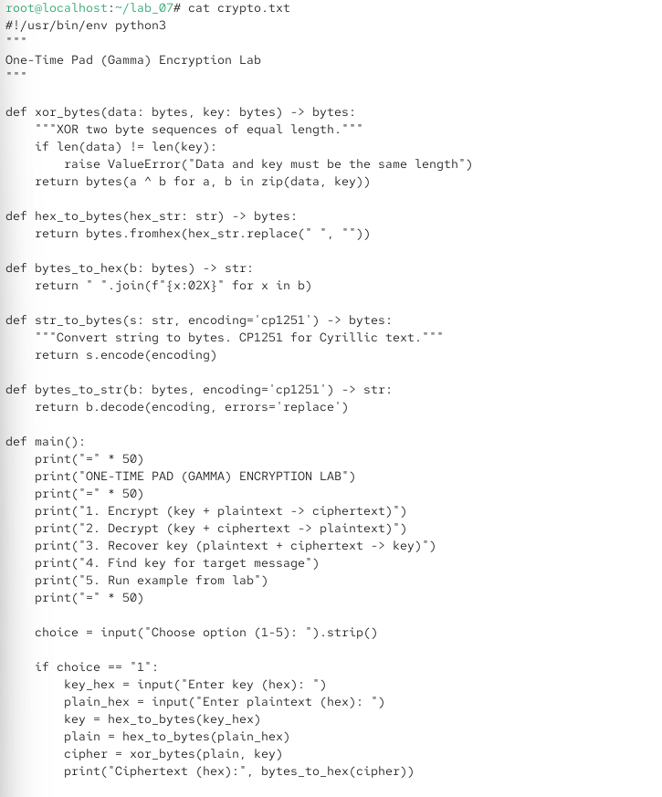
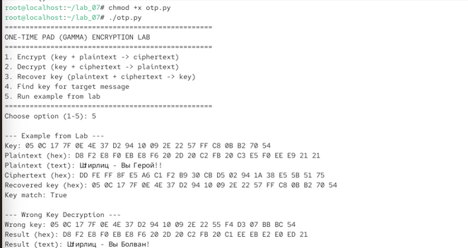
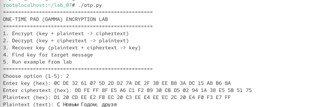

\newpage

{ width=30%} 

# Отчёт по лабораторной работе № 7
Применение режима однократного гаммирования (One-Time Pad)

# Цели и задачи работы

## Цель лабораторной работы
Освоить на практике применение режима однократного гаммирования.

## Задачи

1. Требуется разработать приложение, позволяющее шифровать и дешифровать данные в режиме однократного гаммирования. Приложение должно:
2. Определить вид шифротекста при известном ключе и известном открытом тексте.
3. Определить ключ, с помощью которого шифротекст может быть преобразован в некоторый фрагмент текста, представляющий собой один из возможных вариантов прочтения открытого текста.
4. Подобрать ключ, чтобы получить сообщение «С Новым Годом, друзья!».

\newpage

# Процесс выполнения лабораторной работы

## Создание программы otp.py

Действие: В домашней директории /lab\_07 создать файл otp.py с реализацией режима однократного гаммирования.

*cd \~/lab\_07*
*cat > otp.py*

Листинг программы otp.py:

 

{ width=80% }
{ width=80% }
{ width=80% }

*Рис. 2,3,4 — python*

## Запуск программы
Действие: Сделать файл исполняемым и запустить. Выполнение примера из лабораторной (пункт 5)

{ width=80% }

*Рис. 5 - Отображается меню программы.*

При правильном ключе получается исходный текст «Штирлиц – Вы Герой!!».
При неправильном ключе получается другой осмысленный текст «Штирлиц – Вы Болван!». Это демонстрирует, что при однократном гаммировании даже неверный ключ даёт осмысленный текст, что затрудняет криптоанализ.

## Подбор ключа для сообщения «С Новым Годом, друзья!» (пункт 4)
Действие: Выбрать пункт 4 — «Find key for target message».

{ width=80% }

*Рис. 6 — Ключ вычислен по формуле Ki=Ci⊕Pi Ki , где Ci — шифротекст,Pi — целевой открытый текст.*

## Проверка расшифрования с подобранным ключом (пункт 2)
Действие: Выбрать пункт 2 — «Decrypt».

{ width=85% }

*Рис. 7 — С подобранным ключом шифротекст успешно расшифрован в целевое сообщение «С Новым Годом, друзья».*

\newpage

# Ответы на контрольные вопросы

**1. Поясните смысл однократного гаммирования.**
Это метод симметричного шифрования, при котором на открытый текст накладывается случайная последовательность бит (гамма) той же длины, что и текст. Наложение выполняется операцией XOR. Расшифрование выполняется той же операцией с тем же ключом.

**2. Перечислите недостатки однократного гаммирования.**
Ключ должен быть истинно случайным.
Ключ должен быть той же длины, что и сообщение.
Ключ можно использовать только один раз.
Сложность генерации и распространения ключей большой длины.
При компрометации ключа вся переписка раскрывается.

**3. Перечислите преимущества однократного гаммирования.**
Абсолютная стойкость (доказана К. Шенноном) при выполнении всех условий.
Простота реализации (операция XOR).
Высокая скорость шифрования и расшифрования.
Криптоанализ невозможен при правильном использовании.

**4. Почему длина открытого текста должна совпадать с длиной ключа?**
Потому что гамма накладывается побитово на каждый символ текста. Если ключ короче, его придётся повторять, что нарушает условие однократности и снижает стойкость.

**5. Какая операция используется в режиме однократного гаммирования, назовите её особенности?**
{ width=85% }

**6.Как по открытому тексту и ключу получить шифротекст?**
{ width=85% }

**7.Как по открытому тексту и шифротексту получить ключ?**
{ width=80% }

**8.В чём заключаются необходимые и достаточные условия абсолютной стойкости шифра?**
Полная случайность ключа.
Равенство длин ключа и открытого текста.
Однократное использование ключа.

\newpage

**5. Содержание отчёта**

□ Титульный лист

□ Цель работы

□ Описание процесса выполнения с командами и снимками экрана

□ Листинг программы otp.py

□ Результаты работы программы

□ Ответы на контрольные вопросы

□ Выводы, согласованные с целью работы

# Выводы по проделанной работе

##  Выводы

В ходе лабораторной работы я:

* Разработал приложение otp.py на языке Python, реализующее режим однократного гаммирования.

* Реализовал функции:
 - Шифрование (ключ + открытый текст → шифротекст).
 - Расшифрование (ключ + шифротекст → открытый текст).
 - Восстановление ключа (открытый текст + шифротекст → ключ).
 - Подбор ключа для целевого сообщения.

* Выполнил пример из лабораторной работы:
 - Зашифровал сообщение «Штирлиц – Вы Герой!!» ключом Центра.
 - Получил шифротекст DD FE FF 8F E5 A6 C1 F2 B9 30 CB D5 02 94 1A 38 E5 5B 51 75.
 - При расшифровании неправильным ключом получил осмысленный текст «Штирлиц – Вы Болван!», что демонстрирует стойкость шифра.

* Подобрал ключ для сообщения «С Новым Годом, друзья!»:
 - Ключ: 0C DE 32 61 07 5D 2D D2 7A DE 2F 3B EE B8 3A DC 15 A8 B6 8A.
 - Убедился, что с этим ключом шифротекст расшифровывается в целевое сообщение.

* Убедился, что однократное гаммирование обеспечивает абсолютную стойкость при выполнении всех условий (случайный ключ, равенство длин, однократное использование).

# Цель работы достигнута:
освоено практическое применение режима однократного гаммирования.

\newpage

\newpage

7\. Краткая сводка команд

bash

\# Переход в рабочую директорию

cd \~/lab\_07

\# Создание программы

cat > otp.py

\# (вставить листинг программы)

\# Сделать исполняемым и запустить

chmod +x otp.py

./otp.py

\# Пример работы:

\# Пункт 5 — пример из лабораторной

\# Пункт 4 — подбор ключа для целевого сообщения

\# Пункт 2 — проверка расшифрования

\# Просмотр файла cipher

cat cipher

