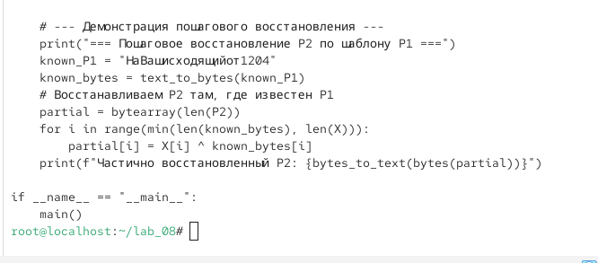

\newpage

{ width=30% }

# перезентация по лабраторной работы №8:
 Элементы криптографии. Шифрование (кодирование) различных исходных текстов одним ключом

# Цели и задачи работы

## Цель лабораторной работы

Освоить на практике применение режима однократного гаммирования на примере кодирования различных исходных текстов одним ключом.

\newpage

# Процесс выполнения лабораторной работы

## Подготовка рабочей директории и создание скрипта

- Создана рабочая директория `lab_08`, содержащая подкаталоги `program` и `report`.
- Создан файл `main.py` с помощью текстового редактора `nano`.
- Файлу предоставлены права на исполнение командой `chmod +x main.py`.
- Выполнен запуск приложения командой `./main.py`.

{ width=50% }

*Рис. 1 — Подготовка директории и запуск приложения*

\newpage

## Исходные данные и вычисление шифротекстов

- Приложение вывело исходные данные:
  - `P1 = НаВашисходящийот1204`
  - `P2 = ВСеверныйфилиалБанка`
  - `K = 05 0C 17 7F 0E 4E 37 D2 94 10 09 2E 22 57 FF C8 0B B2 70 54`
  - `Длина K = 20 байт`
  - `Длина P1 = 20 байт`
  - `Длина P2 = 20 байт`
- Вычислены шифротексты обоих сообщений:
  - `C1 = C8 EC D5 9F F6 A6 C6 27 7A F4 F6 D7 CA BE 11 3A 3A 80 40 60`
  - `C2 = C7 DD F2 9D EB BE DA 29 7D E4 E1 C5 CA B7 14 09 EB 5F 9A B4`

{ width=50% }

*Рис. 2 — Исходные данные и вычисленные шифротексты*

\newpage

## Проверка дешифрования ключом и атака без ключа

- Выполнена проверка дешифрования с использованием ключа:
  - `P1' = НаВашисходящийот1204` (совпадает с исходным P1)
  - `P2' = ВСеверныйфилиалБанка` (совпадает с исходным P2)
- Выполнена операция XOR двух шифротекстов:
  - `X = C1 xor C2 = P1 xor P2`
  - `X = 0F 31 27 02 1D 18 1C 0E 07 10 17 12 00 09 05 33 D1 DF DA D4`
- Восстановлен P2 при известном P1 (без ключа):
  - `P2 (восстановленный) = ВСеверныйфилиалБанка`
- Восстановлен P1 при известном P2 (без ключа):
  - `P1 (восстановленный) = НаВашисходящийот1204`
- Выполнено пошаговое восстановление P2 по шаблону P1:
  - `Частично восстановленный P2: ВСеверныйфилиалБанка`

{ width=50% }

*Рис. 3 — Проверка дешифрования и атака без ключа*

\newpage

## Исходный код приложения main.py (часть 1)

- В приложении реализованы функции:
  - `xor_bytes(a, b)` — побитовый XOR двух последовательностей байтов одинаковой длины.
  - `to_hex(data)` — преобразование байтов в шестнадцатеричную строку.
  - `text_to_bytes(text)` — преобразование текста в байты с использованием кодировки CP1251.
  - `bytes_to_text(data)` — преобразование байтов в текст с использованием кодировки CP1251.
- В функции `main()` заданы исходные данные: P1, P2 и ключ K.

{ width=50% }

*Рис. 4 — Исходный код приложения main.py (часть 1)*

\newpage

## Исходный код приложения main.py (часть 2)

- Выполнено шифрование обоих текстов одним ключом:
  - `C1 = xor_bytes(P1, K)`
  - `C2 = xor_bytes(P2, K)`
- Выполнена проверка дешифрования:
  - `P1_dec = xor_bytes(C1, K)`
  - `P2_dec = xor_bytes(C2, K)`
- Реализована атака без ключа:
  - `X = xor_bytes(C1, C2)` — получение `P1 xor P2`
  - `P2_recovered = xor_bytes(X, P1)` — восстановление P2 при известном P1
  - `P1_recovered = xor_bytes(X, P2)` — восстановление P1 при известном P2
- Реализована демонстрация пошагового восстановления P2 по шаблону P1.

{ width=50% }

*Рис. 5 — Исходный код приложения main.py (часть 2)*

\newpage

# Объяснение логики работы

## Принцип однократного гаммирования одним ключом

- Режим однократного гаммирования реализуется по формуле:
  - `C1 = P1 ⊕ K`
  - `C2 = P2 ⊕ K`
- Если злоумышленник знает оба шифротекста `C1` и `C2`, он может вычислить:
  - `C1 ⊕ C2 = (P1 ⊕ K) ⊕ (P2 ⊕ K) = P1 ⊕ P2`
- Ключ `K` при этом взаимно уничтожается, так как `K ⊕ K = 0`.

## Атака без знания ключа

- Если злоумышленнику известен один из открытых текстов (например, `P1`), он может восстановить второй текст:
  - `P2 = (C1 ⊕ C2) ⊕ P1`
- Если известен `P2`, аналогично восстанавливается `P1`:
  - `P1 = (C1 ⊕ C2) ⊕ P2`

## Пошаговое восстановление по шаблону

- Если один из текстов является шаблоном с фиксированным форматом, злоумышленник может последовательно угадывать символы второго текста, используя известные позиции шаблона.
- На каждом шаге используется формула `P2 = X ⊕ P1`, где `X = C1 ⊕ C2`, а `P1` — известные символы шаблона.
- Это позволяет значительно сократить пространство поиска и постепенно восстановить весь текст `P2`.

\newpage

# Выводы по проделанной работе

## Вывод

В ходе лабораторной работы было освоено на практике применение режима однократного гаммирования на примере кодирования различных исходных текстов одним ключом. Разработано приложение `main.py`, позволяющее шифровать и дешифровать тексты `P1` и `P2` в режиме однократного гаммирования, а также реализующее атаку без знания ключа.

Продемонстрировано, что при шифровании двух различных текстов одним ключом возникает уязвимость: злоумышленник, зная оба шифротекста, может вычислить `P1 ⊕ P2`, что при знании одного из открытых текстов позволяет восстановить второй. Показано, что использование одного ключа для шифрования нескольких сообщений является небезопасным и противоречит условиям абсолютной стойкости шифра.

Полученные результаты согласуются с целью работы.