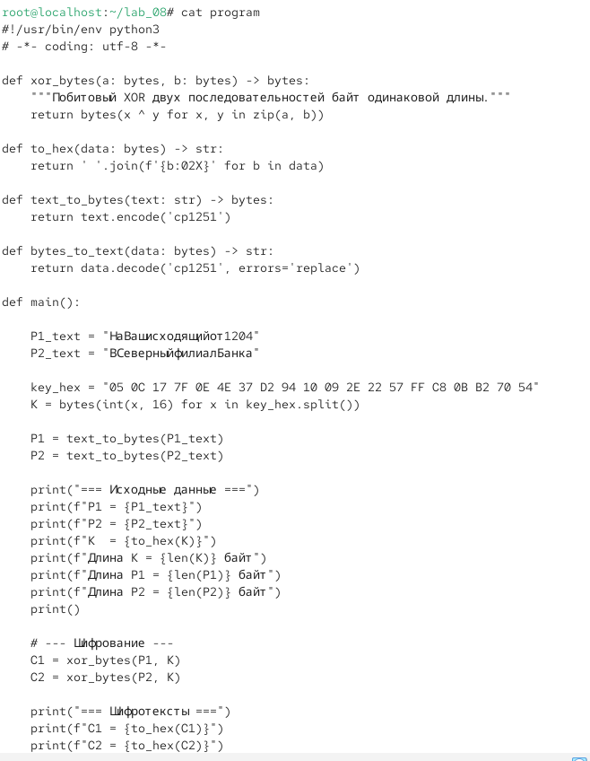
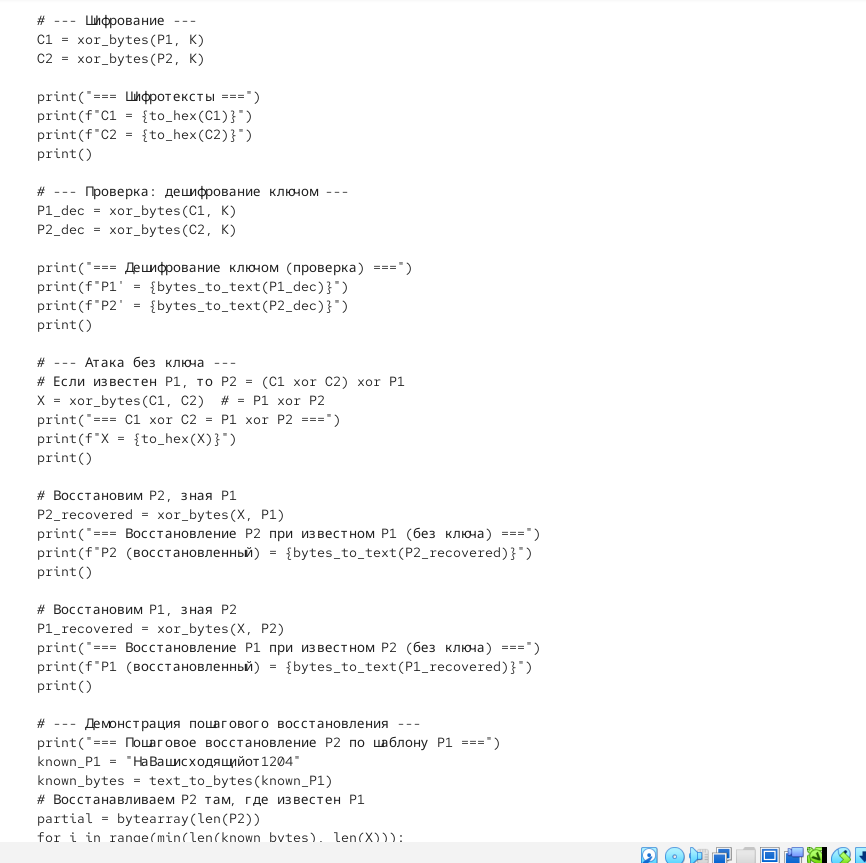
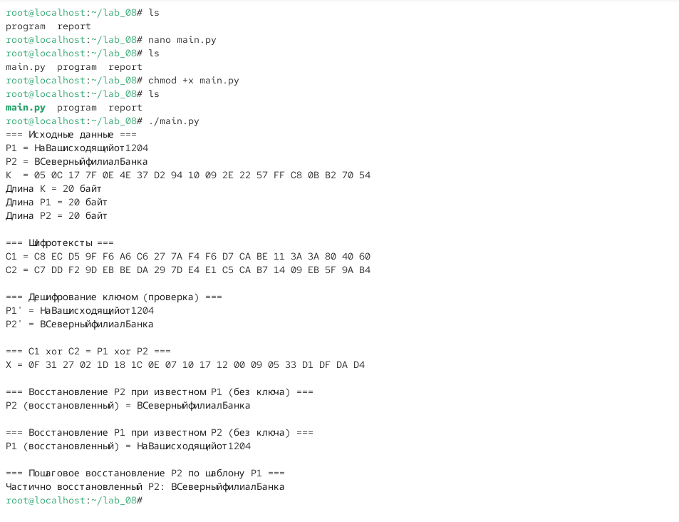
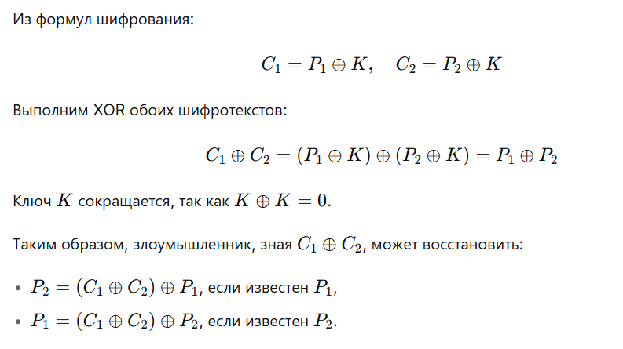
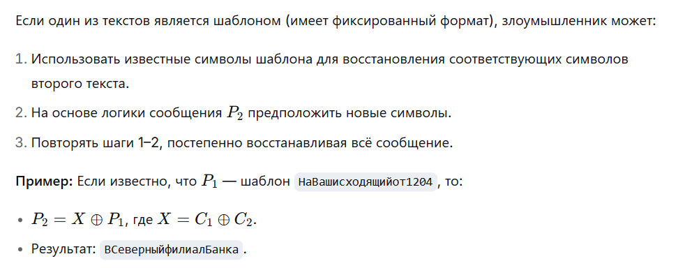
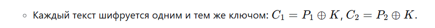
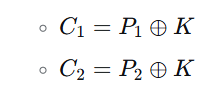
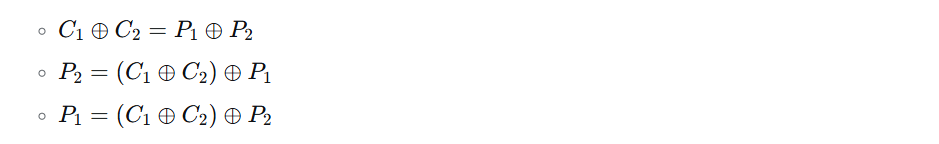
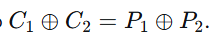

\newpage

{ width=30%} 

# Отчёт по лабораторной работе № 8
Элементы криптографии. Шифрование различных исходных текстов одним ключом

# Цели и задачи работы

## Цель лабораторной работы
Освоить на практике применение режима однократного гаммирования на примере кодирования различных исходных текстов одним ключом.

## Задачи

1. Два текста кодируются одним ключом (однократное гаммирование). Требуется, не зная ключа и не стремясь его определить, прочитать оба текста. Необходимо разработать приложение, позволяющее шифровать и дешифровать тексты P1 и P2 в режиме однократного гаммирования. Приложение должно определить вид шифротекстов C1 и C2 обоих текстов P1 и P2 при известном ключе. Необходимо определить и выразить аналитически способ, при котором злоумышленник может прочитать оба текста, не зная ключа и не стремясь его определить.

Исходные данные:
*P1 = НаВашисходящийот1204*
*P2 = ВСеверныйфилиалБанка*
*Ключ K (20 байт): 05 0C 17 7F 0E 4E 37 D2 94 10 09 2E 22 57 FF C8 0B B2 70 54*

\newpage

# Процесс выполнения лабораторной работы

## Создание программы main.py

Действие: В директории /lab\_08 создать файл main.py с реализацией шифрования двух текстов одним ключом.

*cd ~/lab_08*
*nano main.py*

Листинг программы main.py:

{ width=70% }

{ width=70% }

{ width=70% }

*Рис. 3,4,5 — python*

## Запуск программы
Сделать файл исполняемым и запустить.

{ width=70% }

*Рис. 7*

## Аналитическое обоснование атаки без ключа

Действие: Показать, что злоумышленник может прочитать оба текста, не зная ключа.
Аналитический вывод:

{ width=85% }

Пошаговое восстановление:

{ width=70% }

\newpage

4\. Ответы на контрольные вопросы

**1. Как, зная один из текстов (P1 или P2), определить другой, не зная при этом ключа?**

{ width=70% }

**2. Что будет при повторном использовании ключа для шифрования текста?**
Это нарушает условие однократного использования. Злоумышленник может вычислить P1 ⊕ P2 и, используя шаблоны или логику сообщений, восстановить оба текста без знания ключа.

**3. Как реализуется режим шифрования однократного гаммирования одним ключом двух открытых текстов?**

{ width=70% }

**4. Перечислите недостатки шифрования одним ключом двух открытых текстов.**
Нарушение условия однократного использования ключа.
Возможность восстановления обоих текстов без знания ключа.
Снижение криптостойкости.
Ключ становится уязвимым для атаки.

**5.Перечислите преимущества шифрования одним ключом двух открытых текстов.**
Экономия ключевого материала.
Простота реализации.
Возможность использования одного ключа для нескольких сообщений (при соблюдении дополнительных мер безопасности).

\newpage

# Содержание отчёта

□ Титульный лист

□ Цель работы

□ Описание процесса выполнения с командами и снимками экрана

□ Листинг программы *main.py*

□ Результаты работы программы

□ Аналитическое обоснование атаки без ключа

□ Ответы на контрольные вопросы

□ Выводы, согласованные с целью работы

# Выводы по проделанной работе

##  Выводы

В ходе лабораторной работы я:

1. Разработал приложение main.py на языке Python, реализующее шифрование и дешифрование двух текстов одним ключом в режиме однократного гаммирования.

2. Зашифровал два текста P1 и P2 одним ключом К: 

{ width=70% }

3. Показал аналитически и практически, что злоумышленник может восстановить оба текста, не зная ключа:

{ width=70% }

4. Продемонстрировал пошаговое восстановление P2  по шаблону P1.

5. Убедился, что повторное использование ключа для шифрования разных текстов нарушает условие однократности и снижает криптостойкость.

6. Ключевой вывод: Шифрование двух текстов одним ключом в режиме однократного гаммирования позволяет злоумышленнику восстановить оба текста без знания ключа, используя свойство 

{ width=70% }

7. Это демонстрирует важность однократного использования ключа для обеспечения абсолютной стойкости шифра.

# Цель работы достигнута:
освоено практическое применение режима однократного гаммирования для кодирования различных исходных текстов одним ключом.

\newpage

7\. Краткая сводка команд

bash

\# Переход в рабочую директорию

cd \~/lab\_08

\# Создание программы

nano main.py

\# (вставить листинг программы)

\# Сделать исполняемым и запустить

chmod +x main.py

./main.py

\# Просмотр файла cipher

cat cipher

