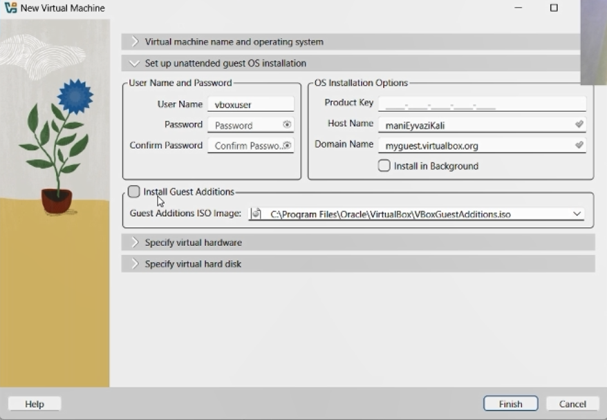
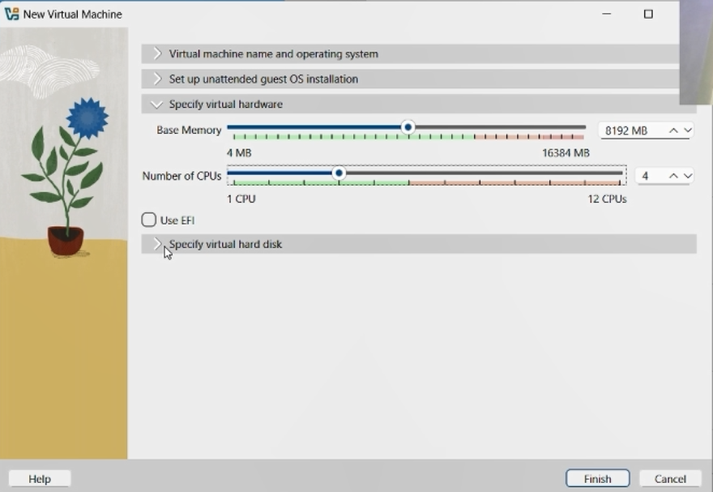
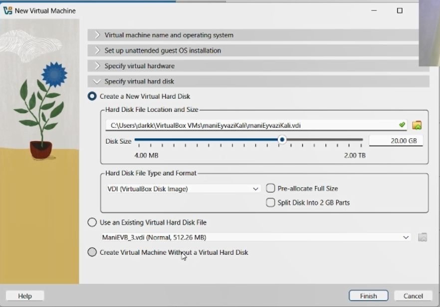
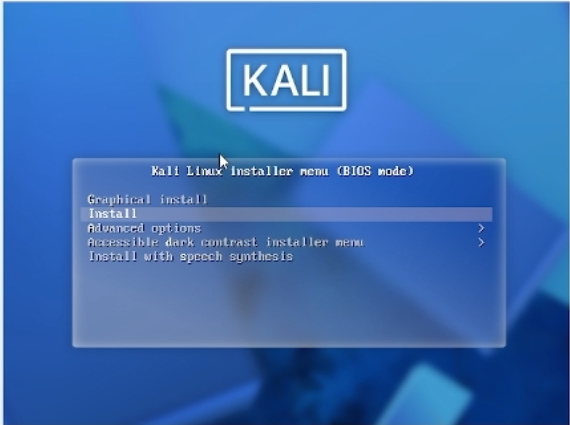
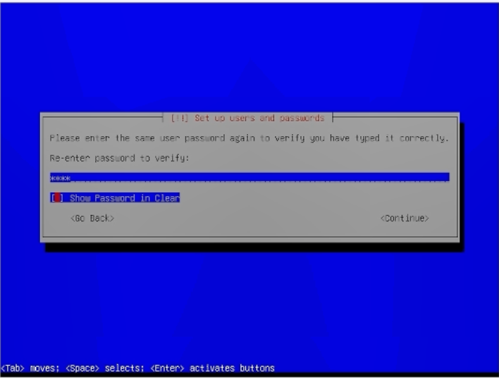
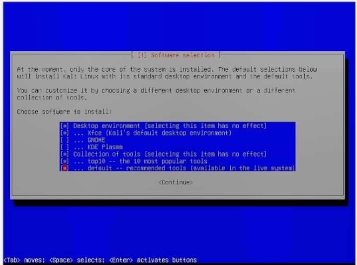
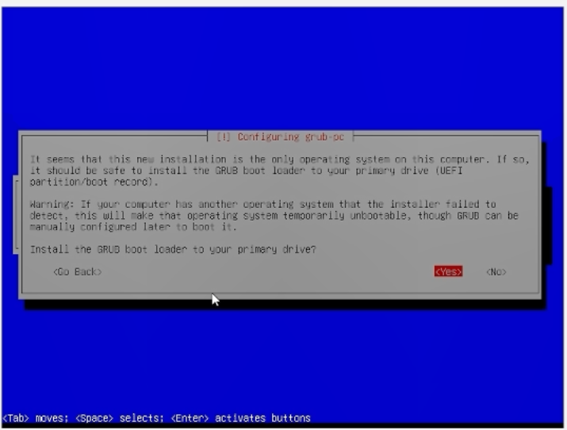
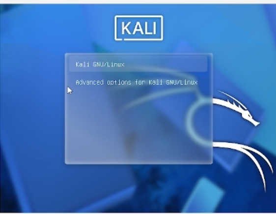
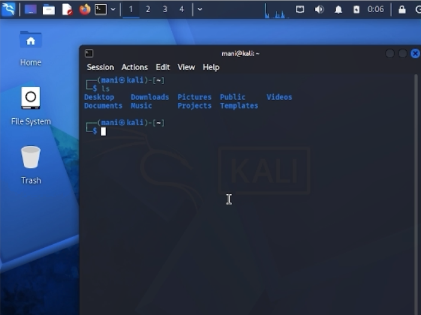

\newpage

# Презентация по индивидуальному проекту № 1

## Установка Kali Linux в виртуальную машину VirtualBox

# Цели и задачи работы

## Цель лабораторной работы

Установить дистрибутив **Kali Linux** в виртуальную машину с использованием среды виртуализации **VirtualBox** для создания изолированной платформы для последующего выполнения лабораторных работ по тестированию безопасности.

\newpage

# Процесс выполнения лабораторной работы

## Шаг 1. Создание новой виртуальной машины

Открываем VirtualBox и нажимаем кнопку **Создать** для создания новой виртуальной машины. В открывшемся окне указываем имя виртуальной машины — `manieyvazi_kali`. В поле «ISO Image» выбираем заранее скачанный установочный образ `kali-linux-2026.2-installer-amd64.iso`. Тип операционной системы — Linux, версия — Red Hat (64-bit). Эти параметры обеспечивают совместимость и корректную работу установщика.

{ width=85% }

*Рис. 1 — Создание новой виртуальной машины и выбор ISO-образа*

\newpage

## Шаг 2. Настройка автоматической установки

На следующем экране VirtualBox предлагает настроить автоматическую установку гостевой ОС. Поскольку мы будем устанавливать Kali Linux вручную, эти настройки можно оставить по умолчанию или пропустить. При необходимости здесь указываются имя пользователя, пароль и доменное имя для будущей системы.

{ width=85% }

*Рис. 2 — Параметры автоматической установки гостевой ОС*

\newpage

## Шаг 3. Настройка аппаратных ресурсов

Задаём объём оперативной памяти для виртуальной машины — **8192 МБ (8 ГБ)**. Количество процессоров — **4**. Эти параметры обеспечивают достаточную производительность для комфортной работы с Kali Linux: запуска графической оболочки, использования браузера, Burp Suite и других инструментов тестирования на проникновение.

{ width=85% }

*Рис. 3 — Настройка объёма ОЗУ и количества процессоров*

\newpage

## Шаг 4. Создание виртуального жёсткого диска

Выбираем опцию **Создать новый виртуальный жёсткий диск**. Указываем расположение файла и его размер — **20.00 ГБ**. Тип диска — **VDI (VirtualBox Disk Image)**. Оставляем настройки по умолчанию (динамическое выделение) и нажимаем **Finish** для завершения создания виртуальной машины.

{ width=85% }

*Рис. 4 — Создание и настройка виртуального жёсткого диска*

\newpage

## Шаг 5. Запуск установки Kali Linux

Запускаем созданную виртуальную машину. Появляется загрузочное меню установщика Kali Linux. Выбираем пункт **Install** для начала установки операционной системы. Этот вариант запускает текстовый установщик, который проведёт нас через все шаги настройки системы.

{ width=85% }

*Рис. 5 — Загрузочное меню установщика Kali Linux*

\newpage

## Шаг 6. Выбор языка установки

Выбираем язык установки — **English**. Этот язык будет использоваться как язык интерфейса установщика, а также как язык системы по умолчанию. При необходимости позже можно будет добавить русскую раскладку клавиатуры и локализацию.

{ width=85% }

*Рис. 6 — Выбор языка установки*

\newpage

## Шаг 7. Создание учётной записи пользователя

Вводим имя пользователя для новой учётной записи — `mani`. Согласно требованиям установщика, имя должно начинаться со строчной буквы и может содержать цифры и строчные буквы. Эта учётная запись будет использоваться для повседневной работы в системе (не root).

{ width=85% }

*Рис. 7 — Ввод имени пользователя*

\newpage

## Шаг 8. Установка пароля

Вводим пароль для созданной учётной записи и подтверждаем его повторным вводом. Для наглядности можно включить опцию **Show Password in Clear**, чтобы видеть вводимые символы. Пароль должен быть достаточно стойким, но при этом запоминающимся, поскольку он будет использоваться для входа в систему.

{ width=85% }

*Рис. 8 — Ввод и подтверждение пароля*

\newpage

## Шаг 9. Разметка диска

Выбираем метод разметки диска — **Guided - use entire disk** (автоматическая разметка всего диска). Этот вариант подходит для большинства случаев и не требует ручной настройки разделов. Установщик сам создаст необходимые разделы: корневой `/`, раздел подкачки `swap` и другие.

{ width=85% }

*Рис. 9 — Выбор метода разметки диска*

\newpage

## Шаг 10. Подтверждение разметки

Просматриваем предложенную схему разметки диска. Видим, что создаётся основной раздел `ext4` размером около 20 ГБ для корневой файловой системы и раздел `swap` около 1.2 ГБ. Убеждаемся, что все параметры корректны, и выбираем пункт **Finish partitioning and write changes to disk** для применения изменений.

{ width=85% }

*Рис. 10 — Подтверждение разметки диска*

\newpage

## Шаг 11. Выбор программного обеспечения

На этапе выбора программного обеспечения оставляем настройки по умолчанию: рабочее окружение **Xfce** (стандартное для Kali), коллекция инструментов и рекомендованный набор утилит. Это обеспечит полноценную установку со всеми необходимыми для работы инструментами тестирования на проникновение.

{ width=85% }

*Рис. 11 — Выбор устанавливаемого программного обеспечения*

\newpage

## Шаг 12. Процесс установки

Начинается процесс установки системы. Отображается прогресс-бар с указанием текущего этапа — например, **Configuring python3-pheonumbers (amd64)**. Установка занимает несколько минут, в течение которых распаковываются и настраиваются все пакеты. Дожидаемся завершения процесса.

{ width=85% }

*Рис. 12 — Процесс установки системы*

\newpage

## Шаг 13. Установка загрузчика GRUB

Установщик предлагает установить загрузчик **GRUB** на основной диск. Выбираем **Yes**, так как это единственная операционная система на данном диске, и загрузчик необходим для корректного запуска Kali Linux при включении виртуальной машины.

{ width=85% }

*Рис. 13 — Установка загрузчика GRUB*

\newpage

## Шаг 14. Завершение установки

После завершения установки и перезагрузки появляется меню загрузки GRUB с пунктами **Kali GNU/Linux** и **Advanced options for Kali GNU/Linux**. Выбираем первый пункт для загрузки системы. Это меню будет появляться при каждом запуске виртуальной машины, позволяя выбрать ядро или режим восстановления.

{ width=85% }

*Рис. 14 — Меню загрузки GRUB*

\newpage

## Шаг 15. Экран входа в систему

Появляется экран входа в систему Kali Linux. Вводим имя пользователя `mani` и пароль, созданные на этапе установки. Это стандартный экран входа в Xfce — рабочее окружение Kali Linux по умолчанию.

{ width=85% }

*Рис. 15 — Экран входа в систему*

\newpage

## Шаг 16. Рабочий стол Kali Linux

После успешного входа открывается рабочий стол Kali Linux с открытым окном терминала. Система готова к использованию. В терминале отображается приглашение `(mani㉿kali)-[~]$`, подтверждающее успешный вход под созданной учётной записью. Все инструменты Kali доступны через главное меню.

{ width=85% }

*Рис. 16 — Рабочий стол Kali Linux после установки*

\newpage

# Выводы по проделанной работе

## Вывод

В ходе индивидуального проекта № 1 была успешно установлена операционная система **Kali Linux** в виртуальную машину **VirtualBox**. Были настроены аппаратные параметры: **8 ГБ ОЗУ**, **4 процессора**, **20 ГБ дискового пространства**. Выполнена ручная установка системы с созданием учётной записи пользователя `mani` и автоматической разметкой диска (корневой раздел `ext4` + раздел подкачки `swap`).

Установка завершилась успешно: система загружается через загрузчик GRUB, корректно работает графическое окружение Xfce, доступны все инструменты тестирования на проникновение из состава Kali Linux. Создана изолированная среда для безопасного выполнения последующих лабораторных работ по анализу уязвимостей веб-приложений, сетевому сканированию и другим задачам в области информационной безопасности.

Полученные навыки развёртывания виртуальных машин и установки операционных систем являются базовыми для любого специалиста в области кибербезопасности и будут использоваться на протяжении всего курса обучения.