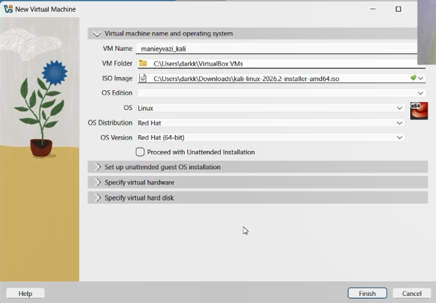
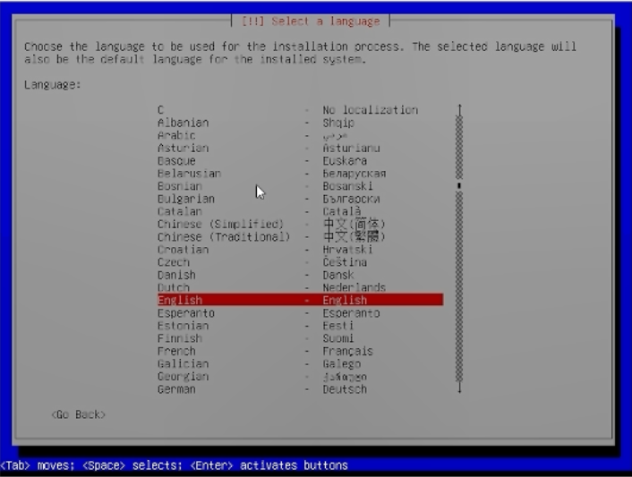
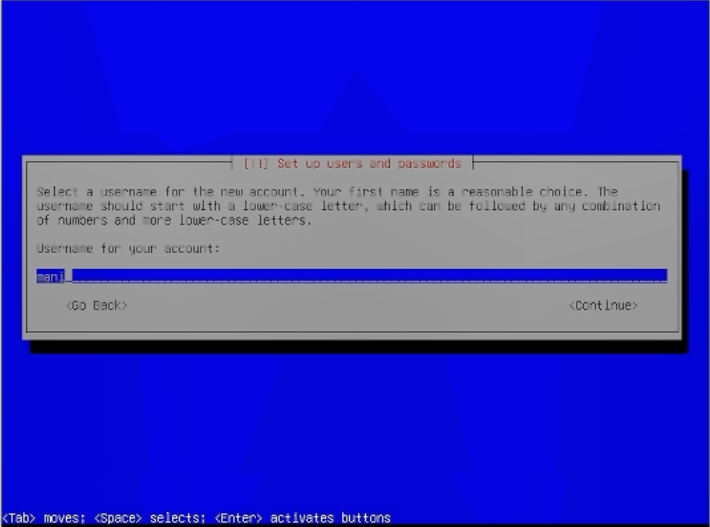
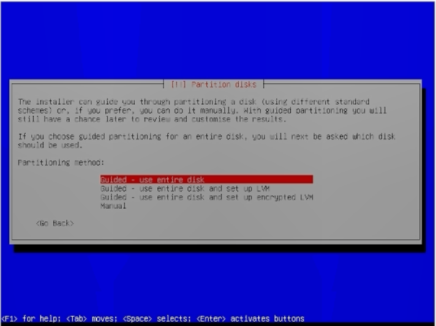
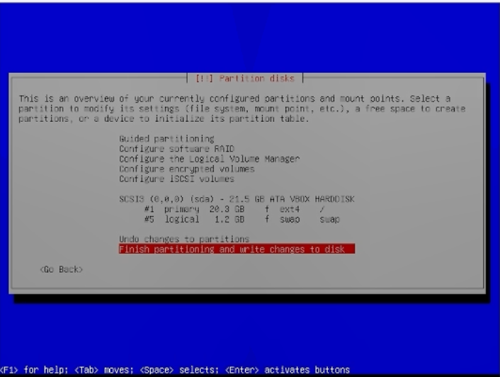
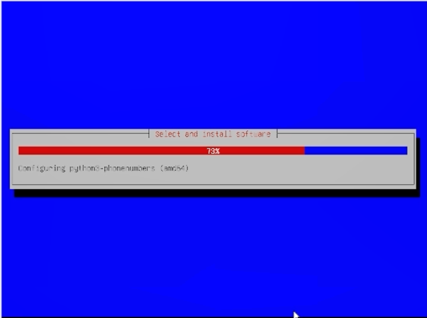
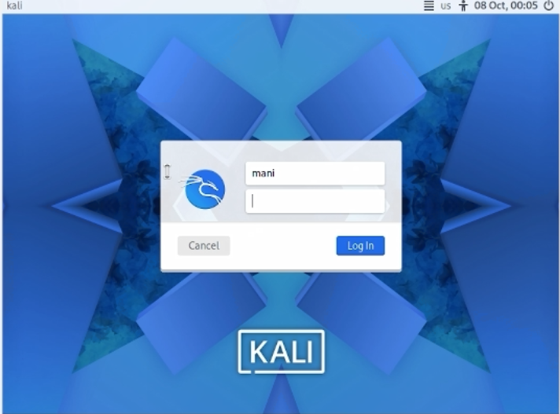

# Цели и задачи работы

## Цель лабораторной работы

Установить дистрибутив Kali Linux в виртуальную машину с использованием среды виртуализации VirtualBox.

## Задачи

1. Создать новую виртуальную машину в VirtualBox.
2. Настроить параметры оборудования виртуальной машины (объём ОЗУ, количество процессоров, размер диска).
3. Подключить установочный ISO-образ Kali Linux.
4. Выполнить установку операционной системы.
5. Настроить учётную запись пользователя и завершить установку.

\newpage

# Процесс выполнения лабораторной работы

## Шаг 1. Создание новой виртуальной машины

Открываем VirtualBox и нажимаем кнопку «Создать» для создания новой виртуальной машины. В открывшемся окне указываем имя виртуальной машины — `manieyvazi_kali`. В поле «ISO Image» выбираем заранее скачанный установочный образ `kali-linux-2026.2-installer-amd64.iso`. Тип операционной системы — Linux, версия — Red Hat (64-bit).

{ width=85% }

*Рис. 1 — Создание новой виртуальной машины и выбор ISO-образа*

## Шаг 2. Настройка автоматической установки

На следующем экране VirtualBox предлагает настроить автоматическую установку гостевой ОС. Поскольку мы будем устанавливать Kali Linux вручную, эти настройки можно оставить по умолчанию или пропустить. При необходимости указываются имя пользователя, пароль и доменное имя.

{ width=85% }

*Рис. 2 — Параметры автоматической установки гостевой ОС*

## Шаг 3. Настройка аппаратных ресурсов

Задаём объём оперативной памяти для виртуальной машины — 8192 МБ (8 ГБ). Количество процессоров — 4. Эти параметры обеспечивают достаточную производительность для комфортной работы с Kali Linux.

{ width=85% }

*Рис. 3 — Настройка объёма ОЗУ и количества процессоров*

## Шаг 4. Создание виртуального жёсткого диска

Выбираем опцию «Создать новый виртуальный жёсткий диск». Указываем расположение файла и его размер — 20.00 ГБ. Тип диска — VDI (VirtualBox Disk Image). Оставляем настройки по умолчанию и нажимаем «Finish» для завершения создания виртуальной машины.

{ width=85% }

*Рис. 4 — Создание и настройка виртуального жёсткого диска*

## Шаг 5. Запуск установки Kali Linux

Запускаем созданную виртуальную машину. Появляется загрузочное меню установщика Kali Linux. Выбираем пункт «Install» для начала установки операционной системы.

{ width=85% }

*Рис. 5 — Загрузочное меню установщика Kali Linux*

## Шаг 6. Выбор языка установки

Выбираем язык установки — English. Этот язык будет использоваться как язык интерфейса установщика, а также как язык системы по умолчанию.

{ width=85% }

*Рис. 6 — Выбор языка установки*

## Шаг 7. Создание учётной записи пользователя

Вводим имя пользователя для новой учётной записи — `mani`. Имя должно начинаться со строчной буквы и может содержать цифры и строчные буквы.

{ width=85% }

*Рис. 7 — Ввод имени пользователя*

## Шаг 8. Установка пароля

Вводим пароль для созданной учётной записи и подтверждаем его повторным вводом. Для наглядности можно включить опцию «Show Password in Clear».

{ width=85% }

*Рис. 8 — Ввод и подтверждение пароля*

## Шаг 9. Разметка диска

Выбираем метод разметки диска — «Guided - use entire disk» (автоматическая разметка всего диска). Этот вариант подходит для большинства случаев и не требует ручной настройки разделов.

{ width=85% }

*Рис. 9 — Выбор метода разметки диска*

## Шаг 10. Подтверждение разметки

Просматриваем предложенную схему разметки диска. Убеждаемся, что все параметры корректны, и выбираем пункт «Finish partitioning and write changes to disk» для применения изменений.

{ width=85% }

*Рис. 10 — Подтверждение разметки диска*

## Шаг 11. Выбор программного обеспечения

На этапе выбора программного обеспечения оставляем настройки по умолчанию: рабочее окружение Xfce (стандартное для Kali), коллекция инструментов и рекомендованный набор утилит.

{ width=85% }

*Рис. 11 — Выбор устанавливаемого программного обеспечения*

## Шаг 12. Процесс установки

Начинается процесс установки системы. Отображается прогресс-бар с указанием текущего этапа — «Configuring python3-pheonumbers (amd64)». Дожидаемся завершения установки.

{ width=85% }

*Рис. 12 — Процесс установки системы*

## Шаг 13. Установка загрузчика GRUB

Установщик предлагает установить загрузчик GRUB на основной диск. Выбираем «Yes», так как это единственная операционная система на данном диске.

{ width=85% }

*Рис. 13 — Установка загрузчика GRUB*

## Шаг 14. Завершение установки

После завершения установки и перезагрузки появляется меню загрузки GRUB с пунктами «Kali GNU/Linux» и «Advanced options for Kali GNU/Linux». Выбираем первый пункт для загрузки системы.

{ width=85% }

*Рис. 14 — Меню загрузки GRUB*

## Шаг 15. Экран входа в систему

Появляется экран входа в систему Kali Linux. Вводим имя пользователя `mani` и пароль, созданные на этапе установки.

{ width=85% }

*Рис. 15 — Экран входа в систему*

## Шаг 16. Рабочий стол Kali Linux

После успешного входа открывается рабочий стол Kali Linux с открытым терминалом. Система готова к использованию. В терминале отображается приглашение `(mani㉿kali)-[~]$`, подтверждающее успешный вход под созданной учётной записью.

{ width=85% }

*Рис. 16 — Рабочий стол Kali Linux после установки*

\newpage

# Вывод

В ходе выполнения индивидуального проекта была успешно установлена операционная система Kali Linux в виртуальную машину VirtualBox. Были настроены аппаратные параметры (8 ГБ ОЗУ, 4 процессора, 20 ГБ дискового пространства), выполнена ручная установка системы с созданием учётной записи пользователя `mani` и автоматической разметкой диска. Установка завершилась успешно, система загружается и готова к дальнейшему использованию для выполнения последующих лабораторных работ.