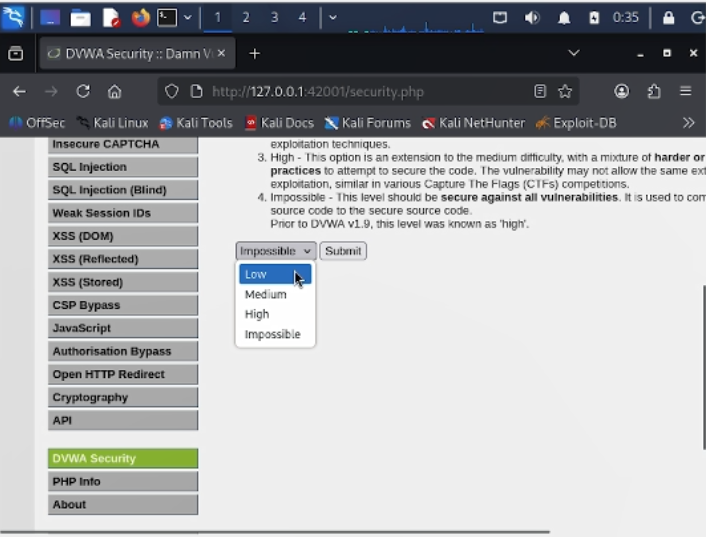

\newpage

# Презентация по индивидуальному проекту № 2

## Установка DVWA в Kali Linux

# Цели и задачи работы

## Цель лабораторной работы

Установить и настроить уязвимое веб-приложение **DVWA** (Damn Vulnerable Web Application) в гостевой системе Kali Linux для последующего изучения и практической эксплуатации типовых уязвимостей веб-приложений.

\newpage

# Процесс выполнения лабораторной работы

## Шаг 1. Установка пакета DVWA

Открываем терминал Kali Linux и выполняем команду `sudo apt install dvwa`. Пакетный менеджер автоматически загружает и устанавливает DVWA из стандартного репозитория вместе с зависимостями: PHP 8.4, libapache2-mod-php8.4, php8.4-mysql, php8.4-cli и другие компоненты. Установка занимает несколько минут.

{ width=85% }

*Рис. 1 — Установка DVWA через пакетный менеджер apt*

\newpage

## Шаг 2. Запуск сервиса DVWA

После установки запускаем сервис командой `sudo dvwa-start`. Скрипт автоматически инициализирует веб-сервер Apache и базу данных MariaDB. В терминале отображается сообщение о том, что веб-интерфейс DVWA доступен по адресу `http://127.0.0.1:42001`. Также выводится предупреждение о необходимости завершить первичную настройку базы данных и учётные данные по умолчанию: логин `admin`, пароль `password`.

{ width=85% }

*Рис. 2 — Запуск сервиса DVWA и получение адреса веб-интерфейса*

\newpage

## Шаг 3. Вход в веб-интерфейс DVWA

Открываем браузер и переходим по адресу `http://127.0.0.1:42001/login.php`. На странице входа вводим учётные данные по умолчанию — имя пользователя `admin` и пароль `password`. После нажатия кнопки «Login» происходит авторизация и перенаправление на главную страницу приложения.

{ width=85% }

*Рис. 3 — Страница входа в DVWA*

\newpage

## Шаг 4. Первоначальная настройка базы данных

После успешного входа DVWA перенаправляет на страницу `setup.php`, где необходимо создать базу данных. На странице отображаются параметры подключения: база данных MySQL/MariaDB, пользователь `dvwa`, пароль `dvwa`, имя базы `dvwa`, хост `127.0.0.1`, порт `3306`. Статус модуля PHP `pdo_mysql` — «Installed». Нажимаем кнопку **Create / Reset Database** для инициализации базы данных.

{ width=85% }

*Рис. 4 — Первоначальная настройка и создание базы данных DVWA*

\newpage

## Шаг 5. Установка уровня безопасности Low

После успешного создания базы данных переходим на страницу **DVWA Security**. В выпадающем списке выбираем уровень безопасности **Low** и нажимаем **Submit**. Уровень Low означает, что все уязвимости полностью открыты и не имеют защиты — это идеальный вариант для обучения базовым техникам эксплуатации, поскольку позволяет наглядно демонстрировать работу каждой уязвимости без дополнительных обходов.

{ width=85% }

*Рис. 5 — Установка уровня безопасности Low*

\newpage

# Выводы по проделанной работе

## Вывод

В ходе индивидуального проекта № 2 была успешно установлена и настроена уязвимая веб-платформа **DVWA** в среде Kali Linux. Пакет был установлен из стандартного репозитория через `apt`, база данных инициализирована через веб-интерфейс `setup.php`, выполнена авторизация с учётными данными по умолчанию (`admin` / `password`).

Установлен уровень безопасности **Low**, что позволяет приступить к изучению и практической эксплуатации типовых уязвимостей веб-приложений: брутфорса, SQL-инъекций, XSS, CSRF, внедрения команд и других. DVWA доступна по адресу `http://127.0.0.1:42001` и полностью готова к использованию в последующих лабораторных работах.

Полученные навыки развёртывания уязвимых приложений в изолированной среде критически важны для безопасного изучения методов тестирования на проникновение, поскольку позволяют экспериментировать с реальными атаками, не нарушая закон и не подвергая рискуproduction-системы.