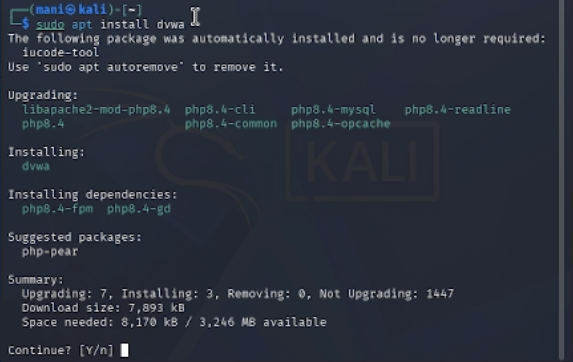
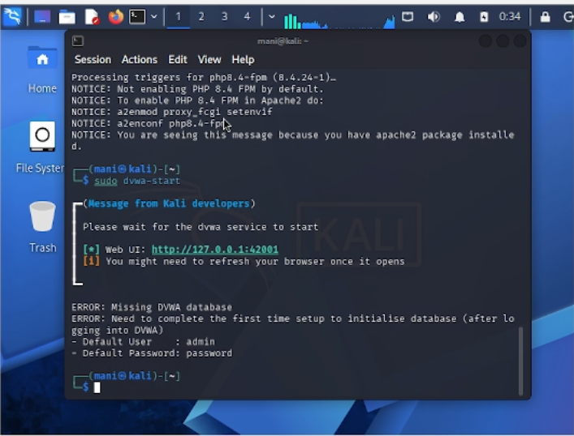
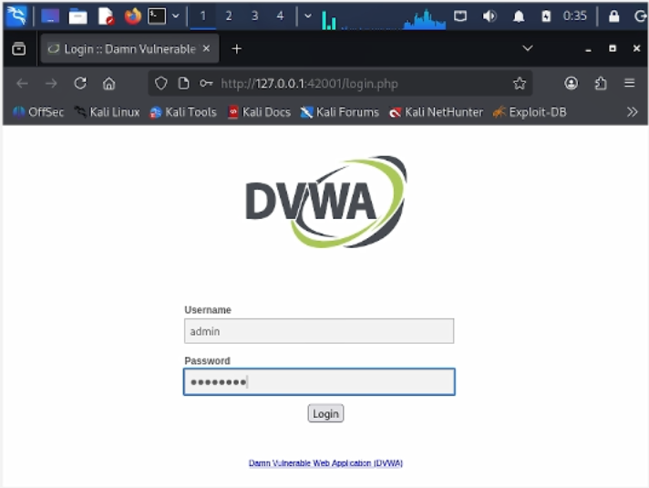
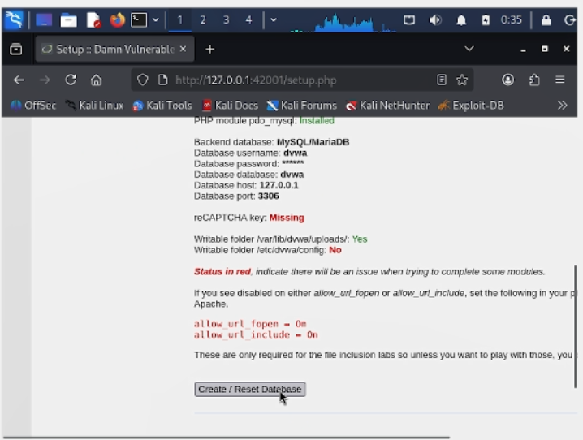

# Цели и задачи работы

## Цель лабораторной работы

Установить и настроить DVWA (Damn Vulnerable Web Application) в гостевой системе Kali Linux для последующего изучения и эксплуатации уязвимостей веб-приложений.

## Задачи

1. Установить пакет DVWA из репозитория Kali Linux.
2. Запустить веб-сервер и сервис DVWA.
3. Выполнить первоначальную настройку базы данных через веб-интерфейс.
4. Войти в приложение с учётными данными по умолчанию.
5. Установить уровень безопасности Low для дальнейших лабораторных работ.

\newpage

# Процесс выполнения лабораторной работы

## Шаг 1. Установка пакета DVWA

В терминале Kali Linux выполняем команду `sudo apt install dvwa` для установки DVWA из стандартного репозитория. Установщик автоматически загружает и устанавливает необходимые зависимости: PHP 8.4, libapache2-mod-php8.4, php8.4-mysql и другие компоненты.

{ width=85% }

*Рис. 1 — Установка DVWA через пакетный менеджер apt*

## Шаг 2. Запуск сервиса DVWA

После установки запускаем сервис командой `sudo dvwa-start`. Скрипт автоматически запускает веб-сервер Apache и базу данных MariaDB. В терминале отображается сообщение о том, что веб-интерфейс доступен по адресу `http://127.0.0.1:42001`. Также выводится предупреждение о необходимости завершить первичную настройку базы данных и указываются учётные данные по умолчанию: логин `admin`, пароль `password`.

{ width=85% }

*Рис. 2 — Запуск сервиса DVWA и получение адреса веб-интерфейса*

## Шаг 3. Вход в веб-интерфейс DVWA

Открываем браузер и переходим по адресу `http://127.0.0.1:42001/login.php`. На странице входа вводим учётные данные по умолчанию: имя пользователя `admin` и пароль `password`, после чего нажимаем кнопку «Login».

{ width=85% }

*Рис. 3 — Страница входа в DVWA*

## Шаг 4. Первоначальная настройка базы данных

После входа система перенаправляет на страницу `setup.php`, где необходимо создать базу данных. Проверяем параметры подключения: база данных MySQL/MariaDB, имя пользователя `dvwa`, пароль `dvwa`, имя базы данных `dvwa`, хост `127.0.0.1`, порт `3306`. Статус модуля PHP `pdo_mysql` — «Installed». Нажимаем кнопку «Create / Reset Database» для инициализации базы данных.

{ width=85% }

*Рис. 4 — Первоначальная настройка и создание базы данных DVWA*

## Шаг 5. Установка уровня безопасности Low

После успешного создания базы данных переходим на страницу «DVWA Security». В выпадающем списке выбираем уровень безопасности «Low» и нажимаем «Submit». Уровень Low означает, что все уязвимости полностью открыты и не имеют защиты — это идеальный вариант для обучения базовым техникам эксплуатации.

{ width=85% }

*Рис. 5 — Установка уровня безопасности Low*

\newpage

# Вывод

В ходе выполнения индивидуального проекта была успешно установлена и настроена уязвимая веб-платформа DVWA в среде Kali Linux. Пакет был установлен из стандартного репозитория, база данных инициализирована через веб-интерфейс, выполнена авторизация с учётными данными по умолчанию. Установлен уровень безопасности Low, что позволяет приступить к изучению и практической эксплуатации уязвимостей веб-приложений: брутфорса, SQL-инъекций, XSS, CSRF, внедрения команд и других. DVWA доступна по адресу `http://127.0.0.1:42001` и готова к использованию в последующих лабораторных работах.