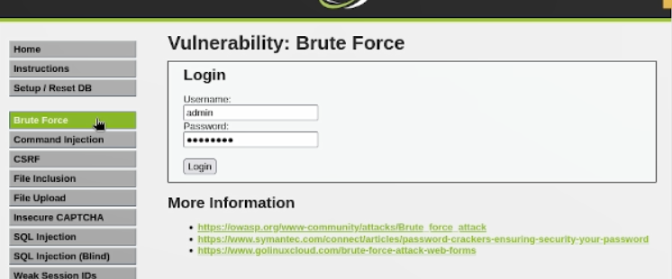
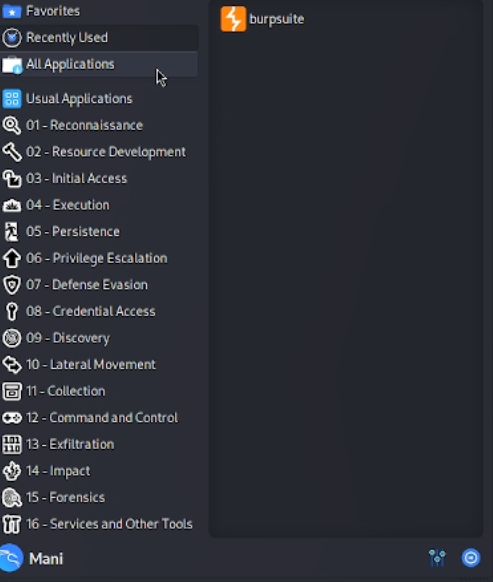
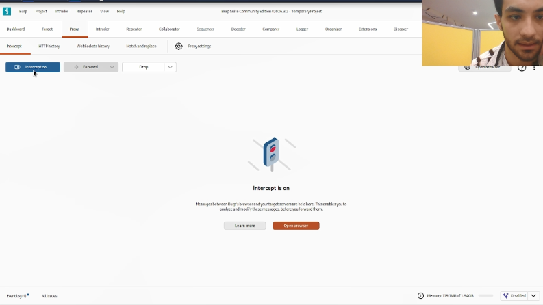
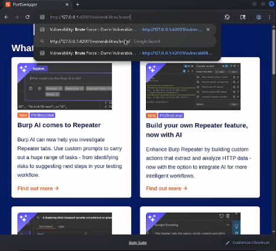
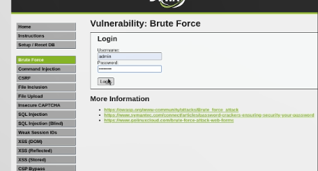
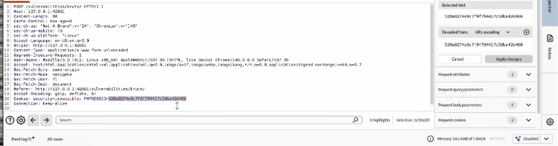

\newpage

# Презентация по индивидуальному проекту № 3

## Использование Hydra для подбора учётных данных

# Цели и задачи работы

## Цель лабораторной работы

Освоить практические навыки работы с инструментом **Hydra** для проведения атаки методом грубой силы (brute-force) на форму аутентификации уязвимого веб-приложения DVWA и продемонстрировать небезопасность слабых паролей.

\newpage

# Процесс выполнения лабораторной работы

## Шаг 1. Открытие уязвимой страницы Brute Force

Открываем в браузере страницу уязвимого приложения DVWA по адресу `http://127.0.0.1:42001/vulnerabilities/brute/`. На странице отображается форма входа с полями «Username» и «Password». Это целевая страница, к которой будет применяться атака перебором. Уровень безопасности DVWA установлен в **Low**.

{ width=85% }

*Рис. 1 — Страница Brute Force в DVWA*

\newpage

## Шаг 2. Настройка Burp Suite для анализа запроса

Для того чтобы Hydra могла корректно взаимодействовать с формой, необходимо понять структуру HTTP-запроса, отправляемого при входе. Запускаем Burp Suite из меню Kali Linux (раздел «01 - Reconnaissance» → Burp Suite) и настраиваем перехват трафика.

{ width=85% }

*Рис. 2 — Запуск Burp Suite из меню Kali Linux*

\newpage

## Шаг 3. Включение перехвата в Burp Proxy

Переходим на вкладку **Proxy** → **Intercept**. По умолчанию перехват выключен — отображается сообщение «Intercept is off». Нажимаем на эту кнопку, чтобы активировать режим «Intercept is on». Теперь все HTTP-запросы браузера будут задерживаться для анализа.

{ width=85% }

*Рис. 3 — Состояние перехвата «Intercept is off»*

\newpage

## Шаг 4. Активация перехвата

После нажатия кнопка меняет состояние на **Intercept is on**. В этом режиме Burp будет останавливать каждый HTTP-запрос, позволяя изучить его содержимое: заголовки, метод, параметры, cookie. Это ключевой шаг для определения правильного модуля Hydra.

{ width=85% }

*Рис. 4 — Активация перехвата «Intercept is on»*

\newpage

## Шаг 5. Отправка формы через браузер Burp

Открываем встроенный браузер Burp и переходим на страницу `http://127.0.0.1:42001/vulnerabilities/brute/`. Вводим произвольные учётные данные (например, `admin` / `password`) и нажимаем «Login». Burp перехватит этот запрос для дальнейшего анализа.

{ width=85% }

*Рис. 5 — Отправка формы входа через браузер Burp*

\newpage

## Шаг 6. Анализ перехваченного запроса

В окне Proxy → Intercept отображается перехваченный запрос. Видим, что используется метод **GET** к адресу `/vulnerabilities/brute/?username=admin&password=password&Login=Login`. Параметры передаются прямо в строке URL. Это означает, что в Hydra необходимо использовать модуль **`http-get-form`**. Также важно запомнить значение `PHPSESSID` из заголовка Cookie — оно потребуется для передачи сессии.

{ width=85% }

*Рис. 6 — Перехваченный GET-запрос к форме входа*

\newpage

## Шаг 7. Формирование команды Hydra

На основе анализа запроса формируем итоговую команду:

    hydra -l admin -P /usr/share/wordlists/rockyou.txt.gz -t 4 127.0.0.1 -s 42001 http-get-form "/vulnerabilities/brute/:username=^USER^&password=^PASS^&Login=Login:H=Cookie: PHPSESSID=528a8274e9c7f9f794417c59ba42d466; security=low:F=Username and/or password incorrect."

В команде: `-l admin` — логин, `-P` — словарь паролей, `-t 4` — потоки, `-s 42001` — порт DVWA, `http-get-form` — модуль для GET-форм. Строка формы содержит путь, параметры с подстановками `^USER^` и `^PASS^`, cookie сессии и строку ошибки для определения неудачного входа.

{ width=85% }

*Рис. 7 — Сформированная команда Hydra*

\newpage

## Шаг 8. Запуск атаки и перебор паролей

Запускаем команду в терминале. Hydra выводит информацию о запуске: количество задач, общее число попыток (14 344 399 строк в словаре `rockyou.txt`) и адрес атакуемой формы. Далее начинается последовательный перебор паролей. Для каждой попытки выводится строка вида `[ATTEMPT] target 127.0.0.1 - login "admin" - pass "123456" - 1 of 14344399`.

{ width=85% }

*Рис. 8 — Процесс перебора паролей в Hydra*

\newpage

## Шаг 9. Итоговая команда и результат

Полная команда, применённая в работе, включает флаг `-V` для подробного вывода. Hydra перебирает пароли из словаря `rockyou.txt` и при нахождении корректного пароля выводит строку вида:

    [42001][http-get-form] host: 127.0.0.1   login: admin   password: password

Это означает успешный подбор учётных данных. Атака продемонстрировала небезопасность слабого пароля `password`, входящего в первую десятку словаря `rockyou.txt`.

{ width=85% }

*Рис. 9 — Итоговая команда Hydra*

\newpage

# Выводы по проделанной работе

## Вывод

В ходе индивидуального проекта № 3 был изучен и практически применён инструмент **Hydra** для проведения атаки методом грубой силы на форму аутентификации DVWA. Освоены ключевые параметры команды: `-l` для логина, `-P` для словаря, `-s` для порта, `-t` для количества потоков, а также модуль `http-get-form` с параметрами `H=` (для передачи cookie) и `F=` (для указания строки неудачной аутентификации).

С помощью Burp Suite был проанализирован HTTP-запрос и определён метод передачи данных (**GET**), что позволило правильно выбрать модуль Hydra. Атака с использованием словаря `rockyou.txt` подтвердила небезопасность слабых паролей: при отсутствии защиты от перебора (CAPTCHA, блокировка после N неудачных попыток) учётные данные могут быть подобраны за приемлемое время.

Полученные навыки применяются при аудите защищённости веб-приложений и демонстрируют важность использования стойких паролей и многофакторной аутентификации.