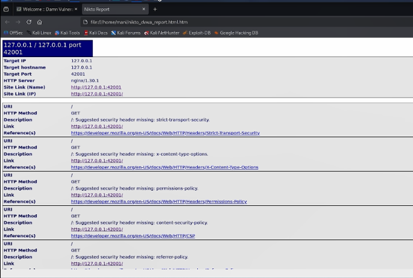

\newpage

# Презентация по индивидуальному проекту № 4

## Использование Nikto для сканирования безопасности веб-сервера

# Цели и задачи работы

## Цель лабораторной работы

Освоить практические навыки работы со сканером безопасности веб-серверов **Nikto** и продемонстрировать его возможности по выявлению типовых проблем конфигурации на примере уязвимого приложения DVWA, развёрнутого в локальной среде Kali Linux.

\newpage

# Процесс выполнения лабораторной работы

## Шаг 1. Проверка установки Nikto

Перед началом сканирования убеждаемся, что Nikto корректно установлен в системе. Переходим в директорию плагинов `/var/lib/nikto/plugins` и запускаем команду `nikto -Version`. В выводе отображается версия **Nikto v2.6.0**, что подтверждает готовность инструмента к работе.

{ width=85% }

*Рис. 1 — Проверка версии Nikto*

\newpage

## Шаг 2. Первый запуск сканирования

Выполняем сканирование локального веб-сервера DVWA с указанием порта `42001`, на котором работает приложение:

    nikto -h 127.0.0.1 -p 42001

Nikto выводит информацию о целевом хосте: IP-адрес `127.0.0.1`, порт `42001`, версию серверного ПО `nginx/1.30.1`. Начинается последовательная проверка сервера по базе известных сигнатур.

{ width=85% }

*Рис. 2 — Запуск сканирования Nikto*

\newpage

## Шаг 3. Обнаруженные проблемы конфигурации

В процессе сканирования Nikto обнаружил **8 проблем** на целевом сервере. Все они относятся к **отсутствующим или устаревшим HTTP-заголовкам безопасности**:

- **Strict-Transport-Security** — не задан заголовок HSTS;
- **X-Content-Type-Options** — защита от MIME-sniffing отсутствует;
- **Permissions-Policy** — не задана политика разрешений браузера;
- **Content-Security-Policy** — не задана политика безопасности контента;
- **Referrer-Policy** — не задана политика передачи referrer;
- **Admin login page found** — обнаружена страница входа (`/login.php`);
- **X-Frame-Options** — устаревший заголовок, заменён на CSP;
- **Content-Type** — не задан явно, риск MIME-confusion.

{ width=85% }

*Рис. 3 — Список обнаруженных Nikto проблем*

\newpage

## Шаг 4. Сохранение отчёта в формате HTML

Для формирования итогового отчёта повторно запускаем сканирование с сохранением результатов в файл:

    nikto -h 127.0.0.1 -p 42001 -o /home/mani/nikto_dvwa_report.html -Format htm

По завершении Nikto выводит итоговую статистику: **8191 запрос**, **0 ошибок**, **8 обнаруженных проблем**, время сканирования — **23 секунды**. Результаты сохранены в HTML-файл для дальнейшего анализа и подготовки отчёта.

{ width=85% }

*Рис. 4 — Сохранение отчёта Nikto в HTML*

\newpage

## Шаг 5. Анализ итогового отчёта

Открываем сохранённый HTML-отчёт в браузере. В верхней части отображается сводка **Host Summary** и **Scan Summary** с ключевыми метриками: целевой хост, порт, версия сервера, количество запросов, найденных проблем и общее время сканирования. Здесь же указана полная команда запуска и версия используемого инструмента.

{ width=85% }

*Рис. 5 — Сводка Host Summary и Scan Summary*

\newpage

## Шаг 6. Детализация обнаруженных находок

В нижней части HTML-отчёта приводится детальное описание каждой находки. Для каждой проблемы указываются URI, HTTP-метод, описание и ссылка на официальную документацию Mozilla (MDN). Например, для отсутствующего заголовка `Strict-Transport-Security` указана ссылка на соответствующую статью MDN с объяснением назначения этого заголовка.

{ width=85% }

*Рис. 6 — Детализация находок в HTML-отчёте*

\newpage

# Выводы по проделанной работе

## Вывод

В ходе индивидуального проекта № 4 был изучен и практически применён **сканер безопасности веб-серверов Nikto**. С его помощью выполнено сканирование уязвимого приложения DVWA, развёрнутого на порту `42001` локального сервера. Nikto выполнил **8191 HTTP-запрос** за **23 секунды**, не встретив ошибок, и обнаружил **8 проблем**, связанных с отсутствием или устареванием HTTP-заголовков безопасности.

Были освоены ключевые параметры команды Nikto: `-h` для указания хоста, `-p` для порта, `-o` для сохранения отчёта и `-Format htm` для выбора формата. Полученный HTML-отчёт содержит структурированную информацию: сводку сканирования, статистику и детальное описание каждой находки со ссылками на документацию.

Основной вывод работы: **Nikto — эффективный инструмент для быстрой оценки конфигурации веб-сервера**, однако он не заменяет специализированные сканеры уязвимостей приложений. Для комплексного аудита безопасности необходимо сочетать Nikto с инструментами динамического анализа (Burp Suite, OWASP ZAP) и ручным тестированием.