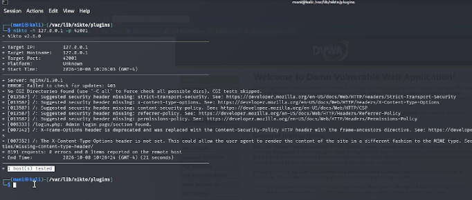
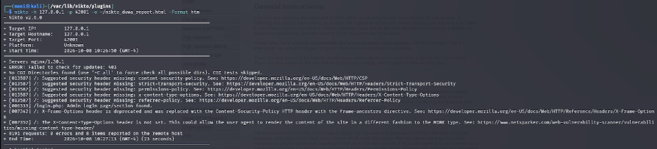
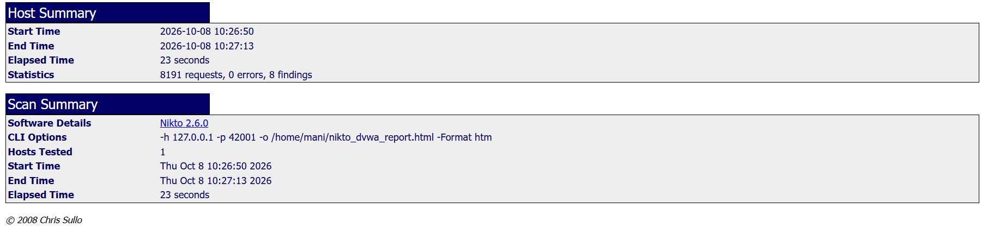

# Цели и задачи работы

## Цель лабораторной работы

Изучить принцип работы сканера безопасности веб-серверов **Nikto** и применить его для сканирования уязвимого веб-приложения DVWA, развёрнутого в локальной среде Kali Linux, с целью выявления типовых проблем конфигурации веб-сервера.

## Задачи

1. Ознакомиться с назначением, возможностями и синтаксисом Nikto.
2. Выполнить базовое сканирование целевого веб-сервера с указанием порта.
3. Проанализировать обнаруженные уязвимости и предупреждения.
4. Сохранить отчёт о сканировании в формате HTML.
5. Изучить структуру сформированного отчёта и интерпретировать его содержимое.

\newpage

# Теоретические сведения

**Nikto** — это базовый сканер безопасности веб-сервера с открытым исходным кодом. Он выполняет комплексное тестирование веб-сервера и обнаруживает потенциально опасные файлы и скрипты, устаревшие версии серверного ПО, а также проблемы конфигурации, которые могут быть использованы злоумышленником.

## Что ищет Nikto

Nikto способен обнаруживать следующие категории проблем:

| Категория | Примеры |
|---|---|
| **Опасные файлы** | Резервные копии, тестовые страницы, файлы конфигурации, доступные извне |
| **Устаревшее ПО** | Старые версии Apache, nginx, PHP, CMS |
| **Неправильная конфигурация** | Отсутствующие заголовки безопасности, открытые листинги директорий |
| **Раскрытие информации** | Полные пути, баннеры сервера, сигнатуры технологий |
| **Учётные данные** | Страницы входа с возможностью подбора пароля |

## Важные особенности

- Nikto работает по **сигнатурному** принципу: он сверяет ответы сервера с базой известных шаблонов.
- Это **не эксплуатационный** инструмент — он только сообщает о потенциальных проблемах, не пытаясь их использовать.
- Сканирование может быть **замечено** системами обнаружения вторжений, поэтому в реальных условиях требует осторожности.
- Результаты носят **информационный характер** и требуют ручной проверки для подтверждения уязвимости.

## Ключевые параметры команды

| Параметр | Назначение |
|---|---|
| `-h <host>` | Целевой хост или IP-адрес |
| `-p <port>` | Порт веб-сервера (по умолчанию 80) |
| `-o <file>` | Файл для сохранения отчёта |
| `-Format <type>` | Формат отчёта (`htm`, `csv`, `txt`, `xml` и др.) |
| `-ssl` | Использовать SSL/TLS |
| `-Tuning <n>` | Выбор типов проверок (например, `-Tuning 123` — только определённые категории) |
| `-Display <n>` | Управление выводом (например, `-Display V` — показывать только найденное) |

\newpage

# Процесс выполнения лабораторной работы

## Шаг 1. Проверка установки Nikto

Перед началом работы убеждаемся, что Nikto установлен в системе. Переходим в директорию плагинов и запускаем проверку версии командой:

    cd /var/lib/nikto/plugins
    nikto -Version

В выводе отображается версия **Nikto v2.6.0**, что подтверждает корректную установку инструмента.

{ width=85% }

*Рис. 1 — Проверка версии Nikto*

## Шаг 2. Первый запуск сканирования

Выполняем сканирование локального веб-сервера DVWA с указанием порта **42001**, на котором работает приложение:

    nikto -h 127.0.0.1 -p 42001

Nikto выводит информацию о целевом хосте:

- **Target IP:** `127.0.0.1`
- **Target Hostname:** `127.0.0.1`
- **Target Port:** `42001`
- **Platform:** `Unknown`
- **Server:** `nginx/1.30.1`

{ width=85% }

*Рис. 2 — Запуск сканирования Nikto*

## Шаг 3. Анализ обнаруженных проблем

В процессе сканирования Nikto обнаружил **8 проблем** на целевом сервере. Рассмотрим их подробнее — все они относятся к **отсутствующим HTTP-заголовкам безопасности**.

### 1. Отсутствует заголовок `Strict-Transport-Security`

    + /: Suggested security header missing: strict-transport-security.

Заголовок **HSTS** сообщает браузеру, что сайт должен использовать только HTTPS-соединения. Без него возможны атаки типа SSL-stripping, при которых злоумышленник понижает защищённое соединение до обычного HTTP.

### 2. Отсутствует заголовок `X-Content-Type-Options`

    + /: Suggested security header missing: x-content-type-options.

Заголовок `X-Content-Type-Options: nosniff` предотвращает MIME-sniffing — попытку браузера угадать тип файла по его содержимому. Без этого заголовка возможны атаки путём загрузки вредоносных файлов под видом безопасных.

### 3. Отсутствует заголовок `Permissions-Policy`

    + /: Suggested security header missing: permissions-policy.

Заголовок **Permissions-Policy** управляет доступом к функциям браузера (камера, микрофон, геолокация). Его отсутствие не критично, но рекомендуется для минимизации поверхности атаки.

### 4. Отсутствует заголовок `Content-Security-Policy`

    + /: Suggested security header missing: content-security-policy.

**CSP** — один из ключевых заголовков защиты от XSS. Он ограничивает источники, из которых браузер может загружать скрипты, стили и другие ресурсы.

### 5. Отсутствует заголовок `Referrer-Policy`

    + /: Suggested security header missing: referrer-policy.

Заголовок **Referrer-Policy** контролирует, какая информация о текущей странице передаётся в заголовке `Referer` при переходе на другие сайты.

### 6. Обнаружена страница входа в систему

    + /login.php: Admin login page/section found.

Nikto обнаружил страницу `login.php` — форму входа администратора. Это ожидаемо для DVWA и показывает, что сканер корректно распознаёт точки аутентификации.

### 7. Устаревший заголовок `X-Frame-Options`

    + /: X-Frame-Options header is deprecated and was replaced with the Content-Security-Policy
       HTTP header with the frame-ancestors directive.

Заголовок `X-Frame-Options` считался стандартом для защиты от clickjacking, но сейчас он **устарел** в пользу директивы `frame-ancestors` в CSP.

### 8. Не задан заголовок `Content-Type`

    + /: The X-Content-Type-Options header is not set. This could allow the user agent to render
       the content of the site in a different fashion to the MIME type.

Отсутствие явного указания `Content-Type` позволяет браузеру самостоятельно определять тип содержимого, что открывает путь к атакам через MIME-confusion.

{ width=85% }

*Рис. 3 — Список обнаруженных Nikto проблем*

## Шаг 4. Сохранение отчёта в формате HTML

Для формирования итогового отчёта повторно запускаем сканирование с сохранением результатов в файл:

    nikto -h 127.0.0.1 -p 42001 -o /home/mani/nikto_dvwa_report.html -Format htm

Параметры команды:

- `-h 127.0.0.1` — целевой хост (локальный);
- `-p 42001` — порт, на котором работает DVWA;
- `-o /home/mani/nikto_dvwa_report.html` — путь для сохранения отчёта;
- `-Format htm` — формат отчёта HTML.

После завершения сканирования в терминале отображается сообщение:

    + 8191 requests: 0 error(s) and 8 item(s) reported on remote host
    + End Time: 2026-10-08 10:27:13 (GMT-4) (23 seconds)

Это означает, что Nikto выполнил **8191 запрос** к серверу, не встретил ошибок и обнаружил **8 проблем**.

{ width=85% }

*Рис. 4 — Сохранение отчёта Nikto в HTML*

## Шаг 5. Просмотр сформированного отчёта

Открываем созданный HTML-отчёт в браузере:

    firefox /home/mani/nikto_dvwa_report.html

В отчёте отображается структурированная информация о сканировании. В верхней части — **Host Summary** и **Scan Summary** с ключевыми метриками:

- **Start Time:** `2026-10-08 10:26:50`
- **End Time:** `2026-10-08 10:27:13`
- **Elapsed Time:** `23 seconds`
- **Statistics:** `8191 requests, 0 errors, 8 findings`
- **Software Details:** `Nikto 2.6.0`
- **CLI Options:** полная команда запуска
- **Hosts Tested:** `1`

{ width=85% }

*Рис. 5 — Сводка Host Summary и Scan Summary*

## Шаг 6. Детализация обнаруженных проблем в отчёте

В нижней части отчёта приведены подробные описания каждой находки. Для каждой проблемы указываются:

- **URI** — путь на сервере, где обнаружена проблема (в данном случае `/`);
- **HTTP Method** — метод запроса (`GET`);
- **Description** — описание проблемы;
- **Link** — ссылка на документацию (например, на MDN для соответствующих заголовков безопасности);
- **Reference(s)** — источники с дополнительной информацией.

Например, для отсутствующего заголовка `Strict-Transport-Security` в отчёте указана ссылка на официальную документацию Mozilla:

    https://developer.mozilla.org/en-US/docs/Web/HTTP/Headers/Strict-Transport-Security

{ width=85% }

*Рис. 6 — Детализация находок в HTML-отчёте*

\newpage

# Результат работы Nikto

## Общая статистика

| Метрика | Значение |
|---|---|
| Целевой хост | `127.0.0.1` |
| Порт | `42001` |
| Версия сервера | `nginx/1.30.1` |
| Всего запросов | `8191` |
| Ошибок | `0` |
| Обнаружено проблем | `8` |
| Время сканирования | `23 секунды` |

## Обнаруженные проблемы

Все 8 обнаруженных проблем относятся к категории **отсутствующих или устаревших HTTP-заголовков безопасности**:

1. **Strict-Transport-Security** — не задан заголовок HSTS.
2. **X-Content-Type-Options** — не задан заголовок защиты от MIME-sniffing.
3. **Permissions-Policy** — не задана политика разрешений браузера.
4. **Content-Security-Policy** — не задана политика безопасности контента.
5. **Referrer-Policy** — не задана политика передачи referrer.
6. **Admin login page found** — обнаружена страница входа администратора (`/login.php`).
7. **X-Frame-Options** — устаревший заголовок, заменён на CSP `frame-ancestors`.
8. **Content-Type не задан** — риск MIME-confusion.

## Интерпретация результатов

Важно понимать, что **отсутствие заголовков безопасности — это не уязвимость сама по себе**, а **ослабление защиты**. DVWA — намеренно уязвимое приложение, поэтому ожидаемо, что его конфигурация не включает защитные механизмы.

Однако в реальной эксплуатации веб-приложения такие находки требуют внимания:

- **Отсутствие HSTS** делает возможными атаки понижения протокола (SSL-stripping), особенно если сайт доступен и по HTTP, и по HTTPS.
- **Отсутствие CSP** означает, что XSS-атаки не блокируются на уровне браузера, что особенно опасно для приложений, работающих с пользовательскими данными.
- **Отсутствие `X-Content-Type-Options: nosniff`** позволяет злоумышленнику загрузить файл, который браузер интерпретирует как исполняемый код, даже если сервер отдаёт его как изображение.
- **Отсутствие `Referrer-Policy`** может привести к утечке чувствительных данных (например, URL с токенами) на сторонние ресурсы.
- **Отсутствие `Permissions-Policy`** даёт возможность нежелательного доступа к функциям устройства пользователя.

## Практическая ценность

Nikto продемонстрировал свою эффективность как инструмент **быстрой оценки конфигурации веб-сервера**. За 23 секунды сканирования он:

- Определил версию серверного ПО (`nginx/1.30.1`);
- Нашёл страницу административной аутентификации;
- Выявил 6 проблем с заголовками безопасности;
- Указал ссылки на документацию для каждой находки.

При этом Nikto не обнаружил **уязвимостей приложения** (SQL-инъекции, XSS, CSRF) — для этого требуются специализированные инструменты (Burp Suite, sqlmap, OWASP ZAP). Nikto дополняет их, обеспечивая проверку **серверного окружения** и **конфигурации**.

\newpage

# Вывод

В ходе индивидуального проекта № 4 был изучен и практически применён сканер безопасности веб-серверов **Nikto**. С его помощью выполнено сканирование уязвимого приложения DVWA, развёрнутого на порту `42001` локального сервера. Nikto выполнил **8191 HTTP-запросов** за 23 секунды, не встретив ошибок, и обнаружил **8 проблем**, связанных с отсутствием или устареванием HTTP-заголовков безопасности.

Освоены ключевые параметры команды Nikto:

- `-h` — целевой хост;
- `-p` — порт;
- `-o` — файл отчёта;
- `-Format htm` — формат сохранения результатов.

Полученный HTML-отчёт содержит структурированную информацию: сводку сканирования, статистику, детальное описание каждой находки со ссылками на документацию. Это делает Nikto удобным инструментом для быстрой первичной оценки защищённости веб-сервера и подготовки отчётов.

Основной вывод работы: **Nikto — эффективный инструмент для выявления проблем конфигурации веб-сервера**, однако он не заменяет специализированные сканеры уязвимостей приложений. Для комплексного аудита безопасности веб-приложения необходимо сочетать Nikto с инструментами динамического анализа (Burp Suite, OWASP ZAP) и ручным тестированием.