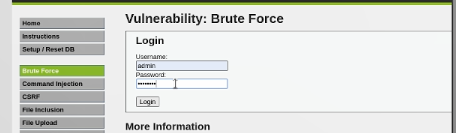
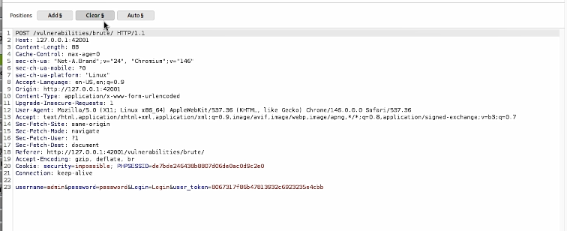
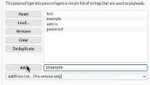
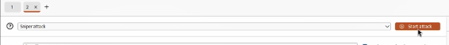

\newpage

# Презентация по индивидуальному проекту № 5

## Использование Burp Suite для тестирования безопасности веб-приложений

# Цели и задачи работы

## Цель лабораторной работы

Освоить практические навыки работы с Burp Suite — комплексным инструментом для тестирования безопасности веб-приложений, и продемонстрировать его возможности по перехвату, анализу и автоматизированному подбору учётных данных на примере уязвимого приложения DVWA.

\newpage

# Процесс выполнения лабораторной работы

## Шаг 1. Открытие страницы Brute Force

Открываем в браузере целевую страницу уязвимого приложения DVWA по адресу `http://127.0.0.1:42001/vulnerabilities/brute/`. На странице отображается форма входа с полями для имени пользователя и пароля. Это классический пример страницы аутентификации, которая будет использоваться для демонстрации возможностей Burp Suite.

{ width=85% }

*Рис. 1 — Форма входа Brute Force в DVWA*

\newpage

## Шаг 2. Передача запроса в Repeater

В окне Burp Suite на вкладке Proxy → HTTP history находим нужный POST-запрос к странице `/vulnerabilities/brute/`. Через контекстное меню (правая кнопка мыши) выбираем опцию **Send to Repeater**. Это позволяет вынести запрос в отдельный модуль для детального анализа и ручной модификации.

{ width=85% }

*Рис. 2 — Передача запроса в Repeater через контекстное меню*

\newpage

## Шаг 3. Анализ структуры POST-запроса

В модуле Repeater отображается полная структура перехваченного POST-запроса. Видим заголовки (`Host`, `Content-Type`, `Cookie` с параметрами `PHPSESSID` и `security=low`) и тело запроса с параметрами `username`, `password`, `Login` и `user_token`. Наличие CSRF-токена показывает, что DVWA использует защиту от подделки запросов, однако на уровне Low она не препятствует атаке.

{ width=85% }

*Рис. 3 — Структура POST-запроса в окне Repeater*

\newpage

## Шаг 4. Передача запроса в Intruder

Из окна Repeater отправляем запрос в модуль **Intruder** через контекстное меню — опция **Send to Intruder** или сочетание клавиш **Ctrl+I**. Intruder предназначен для автоматизации атак перебором и позволяет подставлять значения из словаря в заданные позиции запроса.

{ width=85% }

*Рис. 4 — Передача запроса в Intruder*

\newpage

## Шаг 5. Настройка полезной нагрузки

На вкладке **Payloads** настраиваем список значений для перебора. Используем тип **Simple list** и вводим небольшой набор паролей вручную: `test`, `example`, `admin`, `password`, `123456789`, `123456`, `1234`, `login`, `qwerty` и другие. Короткий список выбран для наглядности, поскольку Community Edition Burp Suite ограничивает скорость атак примерно одним запросом в секунду.

{ width=85% }

*Рис. 5 — Настройка полезной нагрузки в Intruder*

\newpage

## Шаг 6. Запуск атаки и анализ результатов

Запускаем атаку типа **Sniper** кнопкой **Start attack**. В окне результатов отображается таблица со столбцами Payload, Status code, Response received, Length. Ключевое наблюдение: все ответы имеют длину **4722 байта**, кроме одного — с payload **`password`**, длина которого **4710 байт**. Это различие указывает на успешную аутентификацию, поскольку страница приветствия короче страницы с ошибкой. Так был найден корректный пароль.

{ width=85% }

*Рис. 6 — Результаты атаки Intruder с найденным паролем*

\newpage

# Выводы по проделанной работе

## Вывод

В ходе индивидуального проекта № 5 был изучен и практически применён **Burp Suite** — комплексный инструмент для тестирования безопасности веб-приложений. С его помощью выполнена атака методом грубой силы на форму аутентификации DVWA с использованием модуля **Intruder**.

Были освоены ключевые этапы работы: настройка перехвата HTTP-трафика через Proxy, анализ POST-запроса в Repeater, передача запроса в Intruder, настройка позиции подстановки с помощью маркеров `§`, загрузка списка полезных нагрузок и запуск атаки типа Sniper.

В результате атаки был успешно определён корректный пароль **`password`**, ответ на который отличался по длине (4710 байт против 4722 байт у неуспешных попыток). Это подтверждает небезопасность слабых паролей и демонстрирует эффективность Burp Suite Intruder как инструмента для автоматизированного тестирования форм аутентификации.

Полученные навыки могут быть применены при аудите защищённости реальных веб-приложений, а также использованы в дальнейших лабораторных работах по эксплуатации уязвимостей (SQL-инъекции, XSS, CSRF).