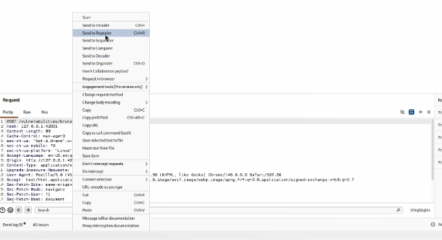
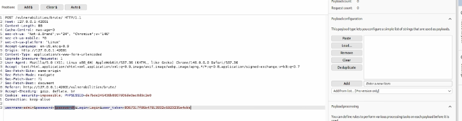
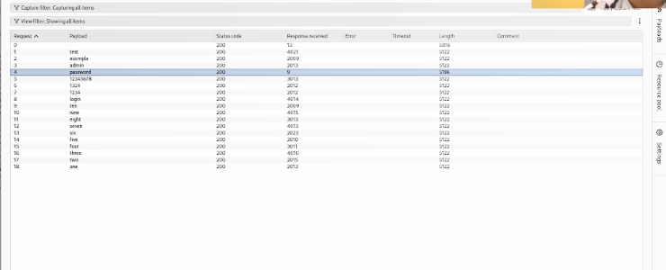

# Цели и задачи работы

## Цель лабораторной работы

Изучить функциональные возможности **Burp Suite** как набора инструментов для тестирования безопасности веб-приложений и практически применить его для анализа и автоматизированного подбора учётных данных формы аутентификации DVWA с помощью модуля **Intruder**.

## Задачи

1. Ознакомиться с назначением и основными компонентами Burp Suite.
2. Настроить перехват HTTP-запросов через модуль **Proxy**.
3. Проанализировать POST-запрос, отправляемый формой входа DVWA.
4. Передать запрос в модуль **Intruder** и настроить позицию для подстановки полезной нагрузки.
5. Загрузить список паролей и запустить атаку типа **Sniper**.
6. Проанализировать результаты и определить корректный пароль по длине ответа.

\newpage

# Теоретические сведения

**Burp Suite** — это интегрированная платформа для тестирования безопасности веб-приложений, разработанная компанией PortSwigger. Она представляет собой набор мощных инструментов, которые демонстрируют реальные возможности злоумышленника, проникающего в веб-приложения, и позволяют безопасно исследовать их поведение в контролируемой среде.

## Основные компоненты Burp Suite

| Компонент | Назначение |
|---|---|
| **Proxy** | Перехватывает и позволяет модифицировать HTTP/HTTPS-трафик между браузером и сервером |
| **Intruder** | Автоматизирует атаки перебором (brute-force, fuzzing, enumeration) |
| **Repeater** | Позволяет вручную изменять и повторно отправлять отдельные запросы |
| **Decoder** | Кодирует и декодирует данные в различных форматах (URL, Base64, hex) |
| **Comparer** | Сравнивает два запроса или ответа на предмет различий |
| **Sequencer** | Анализирует случайность токенов сессии |

## Режимы атаки в Intruder

| Режим | Описание |
|---|---|
| **Sniper** | Одна позиция, один список полезных нагрузок. Классический перебор |
| **Battering ram** | Одна полезная нагрузка подставляется во все позиции одновременно |
| **Pitchfork** | Несколько позиций, несколько списков, подстановка параллельно |
| **Cluster bomb** | Несколько позиций, несколько списков, перебор всех комбинаций |

## Версии Burp Suite

Burp Suite существует в двух основных редакциях:

- **Community Edition** — бесплатная, с ограничением скорости Intruder (около 1 запроса в секунду). Подходит для обучения.
- **Professional Edition** — платная, с полноценным сканером уязвимостей и неограниченной скоростью Intruder.

В данной лабораторной работе используется **Community Edition**, о чём Burp выводит соответствующее предупреждение при запуске Intruder.

\newpage

# Процесс выполнения лабораторной работы

## Шаг 1. Открытие целевой страницы Brute Force

В веб-интерфейсе DVWA переходим по адресу `http://127.0.0.1:42001/vulnerabilities/brute/`. Отображается форма входа с полями «Username» и «Password» и кнопкой «Login». Уровень безопасности установлен в **Low**.

{ width=85% }

*Рис. 1 — Страница Brute Force в DVWA*

## Шаг 2. Передача запроса в Repeater

В главном окне Burp Suite на вкладке **Proxy** → **HTTP history** находим POST-запрос к `/vulnerabilities/brute/`. Нажимаем правой кнопкой мыши на запрос и выбираем **Send to Repeater** (или используем сочетание клавиш **Ctrl+R**).

Это позволяет вынести запрос в отдельный модуль для детального анализа и дальнейшей работы с ним.

{ width=85% }

*Рис. 2 — Контекстное меню с опцией Send to Repeater*

## Шаг 3. Анализ POST-запроса

Открываем вкладку **Repeater**. В окне запроса видим полную структуру POST-запроса:

- **Метод:** `POST`
- **Путь:** `/vulnerabilities/brute/`
- **HTTP-версия:** `HTTP/1.1`
- **Заголовки:** `Host: 127.0.0.1:42001`, `Content-Type: application/x-www-form-urlencoded`, `Cookie: PHPSESSID=...; security=low`
- **Тело запроса:** `username=admin&password=admin&Login=Login&user_token=...`

Важно отметить, что в запросе присутствует **токен CSRF** (`user_token`), который DVWA генерирует для защиты от подделки запросов. На уровне безопасности Low он не мешает атаке, но при более высоких уровнях может потребоваться его обновление.

{ width=85% }

*Рис. 3 — Структура POST-запроса в Repeater*

## Шаг 4. Передача запроса в Intruder

Из окна Repeater нажимаем правой кнопкой мыши на запрос и выбираем **Send to Intruder** (или **Ctrl+I**). Запрос переносится в модуль Intruder для подготовки автоматизированной атаки.

{ width=85% }

*Рис. 4 — Передача запроса в Intruder*

## Шаг 5. Настройка позиции для атаки

Переходим на вкладку **Intruder** → **Positions**. По умолчанию Burp автоматически расставляет маркеры `§` вокруг нескольких значений. Нажимаем кнопку **Clear §** для удаления всех автоматических маркеров.

Затем выделяем только значение параметра **password** в теле запроса и нажимаем кнопку **Add §**. В итоге строка запроса приобретает вид:

    username=admin&password=§admin§&Login=Login&user_token=...

Маркеры `§` указывают Burp, куда именно подставлять полезные нагрузки из словаря.

## Шаг 6. Настройка полезной нагрузки

Переходим на вкладку **Payloads**. Устанавливаем:

- **Payload position:** `1`
- **Payload type:** `Simple list`

В поле **Payload configuration** вводим список паролей вручную. Для демонстрации используется небольшой набор:

    test
    example
    admin
    password
    123456789
    123456
    1234
    login
    qwerty
    abc
    none
    p@ssw0rd
    secret
    letmein
    root
    pass
    admin
    admin123

Использование короткого списка позволяет наглядно показать работу Intruder без длительного ожидания, связанного с ограничениями Community Edition.

{ width=85% }

*Рис. 5 — Настройка полезной нагрузки в Intruder*

## Шаг 7. Запуск атаки

Убеждаемся, что тип атаки установлен в **Sniper**, и нажимаем оранжевую кнопку **Start attack** в правом верхнем углу.

Появляется всплывающее окно с предупреждением о том, что используется **Community Edition**, и скорость Intruder ограничена. Нажимаем **OK** — открывается отдельное окно с результатами атаки.

{ width=85% }

*Рис. 6 — Кнопка Start attack*

## Шаг 8. Анализ результатов атаки

В окне результатов атаки отображается таблица со следующими столбцами:

| Столбец | Описание |
|---|---|
| **Request** | Номер запроса |
| **Payload** | Подставленное значение из словаря |
| **Status code** | HTTP-код ответа (200 — успешно) |
| **Response received** | Размер полученного ответа в байтах |
| **Error** | Признак ошибки (пусто при успехе) |
| **Timeout** | Признак таймаута |
| **Length** | Длина тела ответа |

Наблюдаем ключевую закономерность: **все строки имеют одинаковую длину 4722**, кроме одной — строки с payload **`password`**, длина которой равна **4710**. Это различие в 12 байт указывает на то, что ответ сервера отличается — именно этот запрос привёл к успешной аутентификации.

{ width=85% }

*Рис. 7 — Результаты атаки Intruder с выделенной успешной строкой*

\newpage

# Результат работы Burp Suite

## Общая статистика

| Метрика | Значение |
|---|---|
| Целевой адрес | `http://127.0.0.1:42001/vulnerabilities/brute/` |
| Метод запроса | `POST` |
| Тип атаки | `Sniper` |
| Количество полезных нагрузок | `18` |
| Найденный пароль | `password` |
| Длина успешного ответа | `4710` байт |
| Длина неуспешного ответа | `4722` байт |

## Как был определён корректный пароль

В результатах атаки все запросы с неверными паролями возвращали ответ длиной **4722 байта** (страница с сообщением об ошибке «Username and/or password incorrect»). Единственный запрос с payload **`password`** вернул ответ длиной **4710 байт** — это страница с приветствием пользователя (`Welcome to the password protected area`), которая короче страницы ошибки на 12 байт.

Такой подход — **анализ длины ответа** — является стандартной методикой при работе с Intruder, поскольку визуально ответы почти идентичны, но их размер выдаёт разницу в содержимом.

## Сравнение с Hydra

В отличие от Hydra, использованной в предыдущей лабораторной работе, Burp Suite Intruder предоставляет:

- **Визуальный интерфейс** для настройки позиций и полезных нагрузок;
- **Автоматический парсинг** ответов и отображение их размеров;
- **Возможность ручной модификации** запроса прямо в процессе работы;
- **Гибкие режимы атаки** (Sniper, Pitchfork, Cluster bomb) для сложных сценариев.

Однако **Community Edition** имеет существенное ограничение — скорость около 1 запроса в секунду, что делает её непригодной для перебора больших словарей вроде `rockyou.txt`. В таких случаях лучше использовать Hydra или Burp Professional.

## Практическая ценность

Данная лабораторная работа продемонстрировала полный цикл работы с Burp Suite:

1. **Перехват** HTTP-трафика через Proxy;
2. **Анализ** структуры POST-запроса в Repeater;
3. **Автоматизация** перебора через Intruder;
4. **Интерпретация** результатов по длине ответа.

Эти навыки являются базовыми для любого пентестера и специалиста по безопасности веб-приложений.

\newpage

# Вывод

В ходе индивидуального проекта № 5 был изучен и практически применён **Burp Suite** — комплексный инструмент для тестирования безопасности веб-приложений. С его помощью выполнена атака методом грубой силы на форму аутентификации DVWA с использованием модуля **Intruder**.

Освоены ключевые этапы работы:

- **Настройка Proxy** для перехвата HTTP-трафика;
- **Передача запроса** в Repeater для детального анализа;
- **Передача запроса** в Intruder для автоматизации атаки;
- **Настройка позиции** подстановки через маркеры `§`;
- **Загрузка списка полезных нагрузок** через вкладку Payloads;
- **Запуск атаки** типа Sniper и анализ результатов.

В результате атаки был успешно определён корректный пароль **`password`** — его ответ отличался по длине (4710 байт против 4722 байт у неуспешных попыток). Это подтверждает небезопасность слабых паролей и демонстрирует эффективность Burp Suite Intruder как инструмента для автоматизированного тестирования форм аутентификации.

Полученные навыки могут быть применены при аудите защищённости реальных веб-приложений, а также использованы в дальнейших лабораторных работах по эксплуатации уязвимостей (SQL-инъекции, XSS, CSRF).